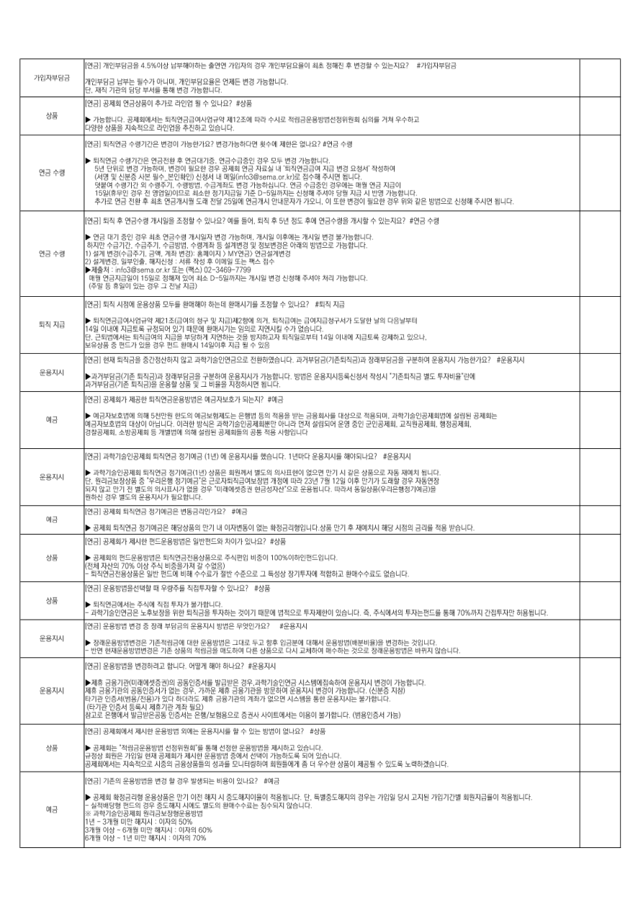
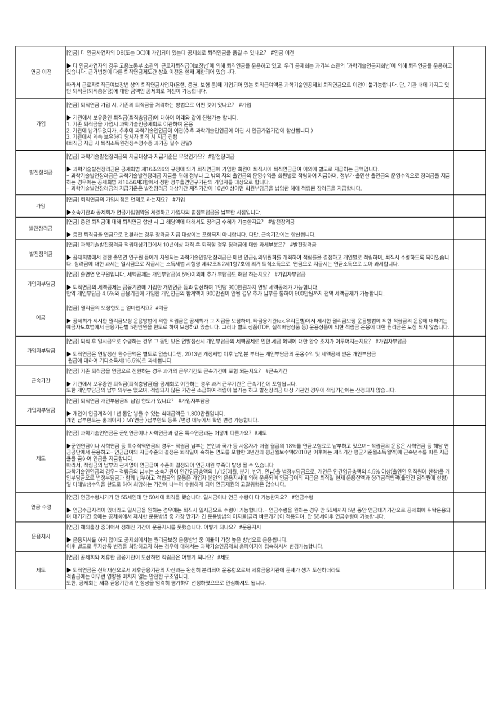

<!-- page: 1 -->
## PDF Page 1

<!-- Start of picture text -->
검색입 력하실하세요!키 워드를 <!-- End of picture text -->

<!-- Start of picture text -->
공제회 퇴 직 연금의 29 가입기 관을 GOs Belg 분담금 이라는 퇴 <!-- End of picture text -->

<!-- Start of picture text -->
수수료 <!-- End of picture text -->

<u>바로가기</u> 

<!-- Start of picture text -->
ogee 산정 방범: 청구대상 기 간의 매월 분담금 합계 <!-- End of picture text -->

<!-- Start of picture text -->
'바로 <!-- End of picture text -->

<u>바로가기</u> 

<!-- Start of picture text -->
- 부담금 EEO AMO] 사유를 기 입 하여 제출 <!-- End of picture text -->

<!-- Start of picture text -->
'바 <!-- End of picture text -->

<!-- Start of picture text -->
되 직 연금 대 여약정서 및점 부서류 를 공제 회로 제출하시면 돕 니다. ( 사본으로선 제출 시, 추후 원본 서류 제출) <!-- End of picture text -->

<!-- Start of picture text -->
담보대여 <!-- End of picture text -->

<!-- Start of picture text -->
중 <!-- End of picture text -->

<!-- Start of picture text -->
사본 제출처 : (이메일) info3@sema.or.kr 또는 (팩스) 02-3469-7799 <!-- End of picture text -->

<!-- Start of picture text -->
MANE - ' 바로 <!-- End of picture text -->

<!-- Start of picture text -->
[연금 Sig SEOs 신 청 방법및제출 서 류는 어떻게 되나요? #중도인 출 <!-- End of picture text -->

<!-- Start of picture text -->
| 되 직 연 금급여 중 도인출 AAR 작성 하시어 AAR) 함께 기관 담 당자에게 제출하시면됩니다 <!-- End of picture text -->

<u>바로가기 바로가기</u> 

<!-- Start of picture text -->
MAN - ' 바로 <!-- End of picture text -->

<!-- Start of picture text -->
[연금 CIAO <!-- End of picture text -->

<!-- Start of picture text -->
[23] £88 SSSA 있는데, SELENG AZ WMO 하나요? #로그인, #공동인증서 <!-- End of picture text -->

<!-- Start of picture text -->
EBSA Ga) VE SAA BAPE 있는 경우, 제휴 금 융기 관 ( 미 래 에섯 증권) 계좌 개설 후, 타 인증서SRS 통해서 BAO] 가 능합니다. <!-- End of picture text -->

<!-- Start of picture text -->
물론OME 제휴 금융기관 (미래에 셋증 권)의 정회원가입은필 수 입니다: <!-- End of picture text -->

<!-- Start of picture text -->
로그인 <!-- End of picture text -->

<!-- Start of picture text -->
[연금 공제 회홈페 이지 에 가입 되어 있는데 BAIA NAME 아이디, 비밀 번호 는 공제회 홈퍼 이 지 와 ZL? #로그 인 <!-- End of picture text -->

<!-- Start of picture text -->
13) 미 래 이셋증 권 에 회원 으로 가 <!-- End of picture text -->

<!-- Start of picture text -->
[연금 운 용 방범 번 경은한번만 할수있는 것인가요? HERA) <!-- End of picture text -->

<u>바로가기</u> 

<!-- Start of picture text -->
' 바로가 기" Bel (정확한 Bele HOSA 홈 페 이지어서 확인 ) <!-- End of picture text -->

<!-- page: 2 -->
## PDF Page 2

<!-- visual fallback: rendered directly from the source PDF page -->

### OCR 보조 텍스트

<!-- Automatic OCR may contain recognition errors; the rendered source page above is authoritative. -->
[etal RIFE 4.5%이상 남무헤아하는 BOM NENG 경우 개인부담요율이 AE 정해진 후 변경할 FANG? ORES
JRINFES — hrumea wee 8471 아니, NOISE 언제든 변경 가능합니다.
fe. 재직 ial 담당 SMe 통해 변경 HS RUG.
lea) aaa caseo se eee e+ 있나요? #상품
가능합니다. BMA HNCIARONINAS 제12조에 Ne 수시로 MBS SUETABH HOE AN 우수하고
[양한 as Alanon aelge 추진하고 있습니다,
leva sie see W201 가능현거요? 번정가능하나면 SIO Ma 없나요? Aa 수형
SHS 수령가간은 ate 후 NANI. 연금수금중인 ae 모두 변경 가능합니다.
0048          54 단위로 #2 가능하며,변경이 필요한 Ae 공제회 연금 자료실 UIs IO 지금 변경 AI 작성하여
eee            (서영 및 신분증 AE We Belson 신청서 내 Aniod@sema ox kz Ba 주시면 BUC,
EOL G72 OIA, 수령방법, SMBS WA 가능하십니다. 연금 Be Ago IB 연금 지금이
TOURED 정우 전 Aim ODS 최소현정기지금일 기준 0-5일까자는 Aled 주셔야 SI a 시 반영 가능함니다.
FE Beal 전한 후 최초 aA SA 전달 25일에 BAIA OER} ALU, 이 또한 변경이 BA AIP FI VE WOE ales 주시면 됩니다.
|연31 되지 후 cate INS 조정할 + 있나요? OS 들어, 퇴직 후 5년 정도 후에 ATS AAI 수 있는지요? #연수영
연금 171 중인 경우 최초 Shae LAIN 변경가능하미, 개시일 OLN 개시일 변경 BEML,
하지만 $2712. $2571 Fae POS 동 WMS 및 BUM O14 WAZ ASHIK.
wate fy eM 02(금주기 금액. 계좌 Wey. AMOK!) 연금) 연금설계번경
[21 ava. 일부인출.해지신청 : 서류 작성 후 이메일 또는 MAH
ABH inic3Bisoma or ke 또는 (MLA) 02-3469-7799
매월 Nea Ol 15윌로 BAHN 있어 최소 0-5일까지는 개시일 WI 신청해 주셔야 처리 가능함니다.
UB ABO 있는 경우 그전낭지3)
|연31 되지 Aso 운용상품 모두을 ROMO 하는데 BOATS ZAM 수 있나요? ARATE
sag | 회지연33이사업규약 marzo 청구 및 지금)제2형에 의거, SIRO: 금여지금청구서가 Swe! wa AWE
19 [ieg olde ABE 04 있기 EOF SHALE 임의로 지연시일 271 없습니다.
|, BOLE 퇴직금여의 Xie EIA MMs 것을 UNIT SAE EH 14일이내에 NZES BAe 있으나.
Seam SBE 있을 ae BE MONA 14일이후 지금 된? 있음
|연31 현재 Sas SURE 않고 과학기승인연금으로 전환하였습니다. WF RRCIESAD BAREIS HOO SEAM 가능한가요? AREA
S80 bpapiauacia salam BayHas 구분하며 운용지시가 ESRC, WE 문용지시등록신청서 BOM TIRES WS RAMS Elo
BARHAVIE Sas S8U 상품 Fes ABSA BUG.
|연21 aaa age seReRwAE MaAwE7 되는지? 8013"
aa             예금자보호법에 의해 SNE BES OLAS 은행법 등 의 ASE we ARIAS AOS ESO. 과학기솔인공제회법매 es BA
ig Awa eo 상이 아닙니다. ole AE 광학기승인공제회뿐만 OF et 먼저 SIS 운영 중인 군인공제회. DALAM, AIBA
Bae Avan s aT Sa see BASES 공통 적용 사항입니다
|연21 Bevis gama Sea 27003 (14) 에 SEAS MBLC. 1년마다 운용지시들 AOIEUIO? #$운용지시
Peon          aeiiaciame SiN BIKA) SHS se wTo| 의사묘현이 BOP 만기 시 BE ABO! NE MOL BUC.
Ie, 원리근보장상품 중 'PHee 37a" e 근로자되직금여보점 7801 따가 23년 7월 129 OF OP GAD BF NBA
[되지 않고 2712 Wel 의사묘시가 없을 경우 ANS Haw OS SHUG. MAM 동일상(우리몬행정기예글
[하신 ae 도의 문용지가 wen
[eal aaa emma wae wae Ie? 002
BAA GIA B7IOGE AEYBS 21 이자번도 없는 확정금리형입니다 상품 만기 후 AOU 3 AO! BAIS NB 받습니다.
[eral Saar ane HESRwRE MRED 차이가 있나요? #상품
             Buse BEReuNe SINMANENROR FAB USO 100%이하인련드입니다.
HNO! 70% 이상 주식 SIM 갈 408)
|- 외직연3전8상품은 일반 REO 비해 A401 절반 FOR 그 Say URN ABCD 환매수수료도 없습니다.
ea 운8방범음선턱회 ease 직점투자할 수 있나요? 상품
Staton: AOL 직점 EAE HL
aes Vede ALAS Het SAS 투자하는 것이기 때문에 AOR 투지제한이 있습니다. &, FNOMO] RABE Bel 7OWMN ZORA SIBLE
\ealeeun was casual Semen Ie FBT
Se           saesuswae esHa0 대현 Sgue 그대로 두고 we Seo 대해서 SeNCHUIAS wR APLC,
|- 반면 현재운용방번변정은 기존 URS Asiae OEE YESS CA ANI Wee ASS BASSE Te MAN AUC.
|연31 eseee wacie 합니다. 어떻게 해야 나요? #운용지시
AF BB7/ MUCHA A)O| BRING Wave AP MOIS AAMOIEsO 운요시 M20 EBLE
운@지시 PHF BINS) BEGAN Ble 정우. 가까운 AB AB /ias BEI SBA WO] SMU. (신분증 지칭)
[기근 eis aceis/ae7 있다 aici MR R728 AE 없으면 ABE Set SBXIl= BRIO,
(71g SBM 등록시 HAIR AN HO)
pine EMO Waweas SME BB/LEBOR BAN AOIEMAE 0180] B7IRUC. (BEA 75)
[eal Sa ANS SoU 20S ENS 할 수 있는 BHO 없나요? FL
a8             BAe 적럽금운용방법 선정위원회" 를 Sa 선정한 SeuNe AAO 있습니다.
정상 sie 가입일 현재 공제회 Ale 운용방법 중에서 UO] 가능하도록 되어 있습니다.
BARRE 지속적으로 ASS ABIES A318 모니터영하여 회원들에게 좀더 우수한 ABO ABE 4 있도록 노릭하겠습니다.
loa 71891 seus wa wae waste MgO 있나요? 4d
BAA WazAM 문용상품은 만기 이전 해지 시 SSANOIBO ARAL. 단, SABLANIO| BPE ALI 당시 BAI IBN 회원지금들이 ABRUIC.
예규 | 소적백9형 Eel 경무 SSA Als BED 환매수수료는 Bes 않습니다.
| 2eviaeiamal 원리3 보장형우용방년
lt - 3개을 미한해지시: 자의 50%
[6개월 이상 ~ eri 미만 ea: 이자의 60%
개원 이상 ~ 1년미만 IAI: ONS 70%

<!-- page: 3 -->
## PDF Page 3

|MP||
|---|---|
|MP||
|MP||
|MP||
|MP|바로가기|

<!-- page: 4 -->
## PDF Page 4

<!-- visual fallback: rendered directly from the source PDF page -->

### OCR 보조 텍스트

<!-- Automatic OCR may contain recognition errors; the rendered source page above is authoritative. -->
Jota 5 연3시엄자의 DBE DOM RISO ed BALE SOAS 물길 수 있나요? #연3 이전
SOLARIS 경우 DBL we ARO '근로자퇴직금여보장밤 에 의해 INAS SOD UD, 우리 BAR: 과기부 ARO '괴학기승인공제회엄 에 의해 퇴직면금응 Veta
[습니다 Siva ci SB AAE A 상호 OIE 현제 ASO 있습니다.
nay 근로자되직금여보장범 상의 INO ZNOER, 6a. YA Bt RICOH 있는 SALON AIS RIAA SEO O10] 볼가능합니다. 단, 기관 OL 가지고 있
fs ACRES 대한 ete! 공제회 이전이 BRL.
leva srs 가임 시. 71891 aE 처리하는 WOR 어떤 201 있나요? #718,
ig 보유종인 SINISE) 대하여 OFF 같이 AES 합니다.
가인 1. 기조 S28 Jig neviaciaitale cn ee
[2 기관에 남거누었다가. Sey 과학기술인연3에 OIE 과학기승인연개 이관 시 연가임기간에 ILC)
[6 ios mg 보유하다 당사자 퇴직 시 지그 진행
외직 지금 시 퇴직소독원천징수영수증 Wid UF OH)
|연21 과혁기승발전장격의 adam 지금기준은 무엇인가요? AREAS
asi iawaseiae amare 제16조의6의 규정에 의거 퇴직연금에 가입한 sO] SIO 퇴직연금그 이외에 별도로 Nase 3액입니다.
|: aeiswesade 과학기승할전장령 Ns 위해 정무 그 밖의 자의 Saal 운영수익음 ABZ 적립하여 지금하며, BR} SAH SAAS 운영수믹으로 장려금 지금
하는 Zeke Aste MORONS ROL 정한 정부출연연구기관의 7M GEE RUC
|- 과혀기승알전장려금의지금가준은 wale 712 WAI 10년이상이면 SIRE Hee AOL eS BeIaS 지금함니다.
기 1031.9983의간시즌고 하는지 0가인
AG 71 BARE AA IIANS ABD UNO] RBS WO! 시정입니다.
오유 [CUBE RMGM A HGS WA a ENO CANE Beta ?핵가가는지: 69887
A _ psu suiag 302 uesie ae Baa 지금 Wate BSN BUG, 다만. 2472 함삽니다
[eral 과하기솔발전장려금 적럼대상기관에서 10년이상 MAF TAD Be eM 대한 ASRS? eA
BARN 8el 80101 연구원 BOA IRI BAIS oINAIAITE 머년 연금심의위원회들 개최하여 MISS AYR NEL 적림하며, HAI FAITE SIONAL
|. eka 대한 i= GANAS 지금시는 AA Ae 제42조의2제1항7호에 의거 SIAROR, 연긍으로 NaN AAAS 보아 과셔함니다.
|연31 출연연 연구원입니다. NOME 개인무윈24.550이외에 추가 RBaS 해당 하는지요? HIBS
가이지부8. | 퇴지연3의 wont 금육기즌에가입한 OIA 등과 한하여 인당 ODE MAY Oy 세역공제가 ZH RL
Ft USAGE 4 Se Se 1aN 가임한 eR AO) 900만원이 안될 정우 추가 FS 통하여 GOONER] 전액 서액공제가 SRL,
leva Bea ware 일마인지요? 002"
공제회가 Ae 원리금보장 운용방법에 의한 AEBS BNP! 그 TRS VAN, CAR7IAex PALMA AAS 원리금보장 Sew ae AZO ee 대하여는
3자보호컨에서 aR 71am See RISE 하며 LAC 있습니다. 그러나 AS AACE, WAM B) SBM 의한 eis BO 대한 Helse 보장 되지 않습니다.
|연21 되직후 일시긍으로 Fae Be 그 동안 we ANNA 개인부된 긍의 MOEA 인한 Ma AUN 대한 환수 ZAPF 이루머지는지요? SERRE
TREES Ip cine caus 환수금액은 ace 없습니다만 2013년 EME! OF HEI REE NEFA S849 SA VE NLS
tol 대하여 기타소득세(16 9 고세콤니다,
|연21 기존 sae Mace 전환하는 정우 AAI 근무간도 ea 포항 되는지요? #근속기간
Sekt          710 BEBO SIIB GINSHANS BuaZ 이근하는 경우 과거 BB7IZ2 B47!201 BARBY
한 MISES 남부 Oe 없으며. 적러지 입은 기간은 소금하여 MOI 불가능 하고 WAC CA 기관인 IRON AAPL AISI 습니다.
|연21 되직언 needa we 한도가 있나요? #가입지부됨금
ZARB | 개인이 연3게제 1년 Bet 넣을 + 있는 GAME 1.800만원입니다.
[인 eet MOI) 연금 )남부한도 BS 변경 미뉴메서 확인 We HL
lal meriagieae seen 사하연긍과 ve 득수연금과는 ON ee? ems
-2QOROIL Hela 등 SARS 경우- 적립금 남무는 EOIN BS SAVE 매월 BIO) 18%틀 MALES 남부하고 있으며- AAS See ASIN 5 해당 OL
Sac 운용하고-연금금며의 지금순의 ABS HAO] 속하는 ASR Bee! 3년간의 BAL SZOIOS OIRO NA BATERARBN SAU NE 지금
제도 fee asi Sas aque,
faethe west 관계없이 aol 준이 결정되어 ONE emo We 될 수 있습니다
NOSIS 경우-적리의 B= 소속기관이 연간임총액의 1/1218, BI], 반기. ANS 멈정부됨으로. role 연간임3총액의 4.5% OLSON AIBC 71
[인부됨으로 Wakdan am 남부하고 Meno 문용은 JN Pela BRAIN 의해 SSO Sasol ASE HAD 현재 SoU ADAM SAA BARON 한함)
Px oahses te 한도로 하여 BIER 기간에 나누어 수랭하게 되어 SMHS BABE 없습니다.
|연21.연2수경시기가 a 55세인데 안 50세에 SNE 했습니다 AION 연금 PNG SBR? 002 수령
2398p 연금%금자적이 있더라도 ane 원하는 APO IN 일시금으로 480) eMC 연금수랭응 원하는 OP 만 55세끼지 5년 동안 IACI LIOR BAN HESS
ok 대기기간 중에는 BARON Ale Sew 중 가장 WIZ Sewels Osa 바로가기)이 ABI, 만 55서이후 Mara 가능함니다.
[eral meee S00 정해진 기간에 운용지실 못했습니다. OA 되나요? #운용지시
canes          SBS 3 QOS BARON: RIAL 운용방범 중 O1g0) 가장 we WOR REEL,
ig ace SNe Wie SION 하는 IPO GAME HEE LAC ART AMOI Hash 번정가능함니다.
loa) saa Re 3기관이 도산하면 Bae OBA 되나요? ems
게도            Sie SeMNIORN MARTINS! Neale 완전히 HAISO| SSORM 제금융기관에 SAH 생거 도산하더라도
|적임에는 Olea! 85s 미치지 않는 안전한 구조임니다.
a) SME 제 AAEM VE 엄격히 BIRO 선정하였으므로 ENE BUC.

<!-- page: 5 -->
## PDF Page 5

||·|
|---|---|
|MP||

<!-- page: 6 -->
## PDF Page 6

<!-- Start of picture text -->
미납 <!-- End of picture text -->

<!-- Start of picture text -->
%사 <!-- End of picture text -->

<!-- Start of picture text -->
다만, 특별한 사 정이 있는 경 우에는당사자 간의 합의 에 따라 납입 기 일 을 연 장할 수 있습니다. <!-- End of picture text -->

<!-- Start of picture text -->
[ia] 공제회 퇴직 연 금도 국민 연 금처럼 기금이 부실화 될 우 려 는 없나요? <!-- End of picture text -->

<!-- Start of picture text -->
제도 <!-- End of picture text -->

<!-- Start of picture text -->
> 콕민연금 의 경우 현 <!-- End of picture text -->

<!-- Start of picture text -->
근로자가 자기 책 임 하에 그 적립금을 운용하여퇴 직 연금을 마련 하기 때문에 기 금고갈의 위험은 없으나, <!-- End of picture text -->

<!-- Start of picture text -->
운용과 정 에서 투자 성 과에 따라 퇴직 이 후 의 퇴 직 연 금 액 이 달라질 수 있습니다. <!-- End of picture text -->

<!-- Start of picture text -->
[oie] 확정 기 여 형의 경우 근로자의 급여액 이 붙안정 하다고 볼 수 있는데, 이에대한 방 지책 은? <!-- End of picture text -->

<!-- Start of picture text -->
[연금] 원리금 보장 운용방 법 이란 무엇인가요? <!-- End of picture text -->

<!-- Start of picture text -->
oe <!-- End of picture text -->

<!-- Start of picture text -->
| 연 금 | 과학기 솔인 연 금 회원 이 회원부담금을 남부한다고 합니다. 입금 과 납입 한도 번 경은 어떻게 해야 하나요? # 가 입자부담금 <!-- End of picture text -->

<!-- Start of picture text -->
'과학기술인공 제회연금사업 실 ' 을 통해 처 리 가 가 능합니다. <!-- End of picture text -->

<!-- Start of picture text -->
가 입 자부팀 금 <!-- End of picture text -->

<!-- Start of picture text -->
cain직 지 급 <!-- End of picture text -->

<!-- Start of picture text -->
운 용 지시 <!-- End of picture text -->

|〮  〮  〮 회원부담금추가납입신청 =과학기술인공제회홈페이지(/.56108.0「.40로그인 ~연금>14* 퇴직연금>온라인신청및현황> 추가납부신청(회원별가상계좌발급후신청및송금) 연간남입한도등록/변경 -과학기술인공제회홈페이지로그인후연금>/\ 퇴직연금>남입한도등록 부득이한경우추가남입서류제출가능 -제출처:과기공SEACH이메일orMA 발송(신청서침고_과기공대표홈페이지자료실) *과학기술인연금세제혜택및남입한도:OC퇴직연금제도와동일하게ASM적용 (퇴직연금계좌세액공제한도연간900 만원,연금저 축의경우연간600 만원까지적용_2023.1.1 일이후남입분부터적용)|
|---|
|·  · [ote 과학기솔인연금회원이퇴직예정이라고합니다. 퇴직급여신청은어떻게해야하나요? #퇴직AB 과학기솔인연금퇴직급여수령방법은일시금, 공제회연금(과학기술인연금),개 인16 이전중에선택할수있습니다. 퇴직급여신청서에수령방법및수급시기등선택하여기관의퇴직연금담당자에게제 출하면과학기술인공제회를통해지급접수됩니다. 또한공제회연금, SAL IAP 이전의경우에도현물이전은불가하며지급청구시보유중인ABS 전부매도되어현금으로지급처리됩니다. 퇴직연금(08/00) 에도가입된회원의경우별도로퇴직급여(2870)지급신청을해야하며,과학기솔인연금퇴직급여신청시해당퇴직급여(28/00)의원천징수영수증이함께제 되어야합니다. (동일년도퇴직소득: 강제합산과세대상) *공제회연금:만55세이후연금수령가능. 수급기간최소10 년부터최대35년까지SUA단위로선택가능. 연금수령시점까지연금대기기간으로과학기술인공제회에위탁운용되며,공제회에서제시한운용방법중가장만기 가긴운용방법의이자율이적용됨 |연금]과학기솔인연금도디폴트옵션제도적용이되나요? #운용지시 과학기술인연금은과학기술인공제회법적용을받고있어현재디폴트옵션ASE 적용되지않습니다. 따라서디폴트옵션제도와BS기본투자상품적용및과학기술인공제회예금의경우만기재예치가유지됩니다. (단, 우리은행예금과같이퇴직연금원리금보장상품의경우만기상환적용) 과학기술인공제회예금(1년):만기전별도의운용지시가없을경우동일상품으로재예치(재예치시고시이율적용) SASH 예금(3개월,6개뭘,1년) : 퇴직연금원리금보장상품으로서근로자퇴직급여보장법개정에따라2023년7월12일이후만기전별도의의사표시가없을경우만기상환적용, 미래에셋증권현금성자산으로See    |
