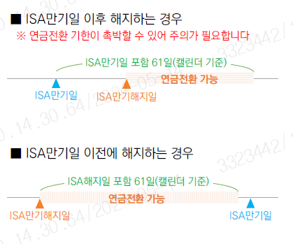
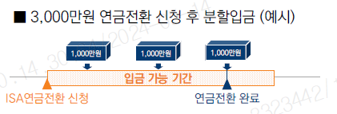

<!-- Slide number: 1 -->
# 연금계좌 만기ISA전환입금 업무 자주 나오는 FAQ
 [연금저축,IRP공통]
2024.05

<!-- Slide number: 2 -->
Contents
연금계좌로 만기ISA 전환시 60일 이내에 입금되어야 하는데 정확한 60일 기준은 언제까지인가요?
Q 1

ISA연금전환을 완료한 후 취소가 가능한가요?
Q 2
ISA해지부터 연금전환까지의 흐름을 정리해주세요
Q 3
만기일로부터 60일 이내라면 연금계좌 전환입금시 여러 차례 나눠서 입금할 수 있나요?
Q 4
Q 5
만기 전환금액으로 연금계좌에 입금한 금액은 출금이 가능한가요?
Q 6
 연금계좌내 ISA만기전환금액 외에 입금액이 없을 때 당해연도 세액공제 가능금액은 얼마인가요?

<!-- Slide number: 3 -->
FAQ
# 만기ISA 연금전환 업무

      -  ISA만기일이 기준이며, 조회 및 입금확인 처리시점 60일 이내에 만기 해지된  ISA계좌가 있어야합니다.(60일은 캘린더 기준, 만기일 당일 미포함)

연금계좌로 만기ISA 전환시 60일 이내에 입금되어야하는데 정확한 60일 기준은 언제까지인가요?
Q1

ISA연금전환을 완료한 후 취소가 가능한가요?
Q2
ISA연금전환이 완료되면 은행연합회에 정보가 등록되어 취소는 불가합니다. 연금저축계좌의 경우 당해연도 전환금액은 인출이 가능하지만,
     이미 한도가 소진된 금액으로서 재납입은 불가합니다. (Q5참조)

<!-- Slide number: 4 -->
# 만기ISA 연금전환 업무
FAQ
ISA해지부터 연금전환까지의 흐름을 정리해주세요
Q3

STEP1.

ISA계좌 만기해지 (영업점 방문 OR 유선)

STEP2.

ISA전환입금신청
 -M-STOCK : ① 만기ISA전환신청 ☞ 경로 : 연금 → 연금관리 → 연금입금관리 → ISA 전환입금 메뉴

STEP3.

ISA전환금액 입금 및 만기ISA전환입금확인

※ 만기ISA 전환입금의 완료여부에 대한 최종확인 필요

<!-- Slide number: 5 -->
# 만기ISA 연금전환 업무
FAQ
만기일로부터 60일 이내라면 연금계좌 전환입금시 여러 차례 나눠서 입금할 수 있나요?
Q4
가능합니다. ISA 만기 해지된 금액 내에서 60일 이내 횟수 제한 없습니다.

만기 전환금액으로 연금계좌에 입금한 금액은 출금이 가능한가요?
Q5
연금저축계좌의 경우에만 가능합니다.

- 전환완료 다음연도부터  만기ISA전환 납입액에서 세액공제대상금액을 제외한 나머지 금액은 비과세재원으로 반영, 인출 및 세액공제전환특례 가능합니다.

당해연도 인출 시에는 당해연도 납입금액 안에서 인출 가능하며, 인출금액 재납입은 불가능합니다.
   하지만,  당해 년도 납입금액이 인출되면  세액공제 혜택을 받지 못 할 수도 있으므로 유의하여 주시기 바랍니다.

<!-- Slide number: 6 -->
# 만기ISA 연금전환 업무
FAQ
 연금계좌내 ISA만기전환금액 외에 입금액이 없을 때 당해연도 세액공제 가능금액은 얼마인가요?
Q6

  *  세액공제 대상 납입액 한도 + ISA전환 입금 금액의 10%(최대 300만원)
     개인형IRP = 900 + 300 = 1,200만원   /  연금저축 = 600 + 300 = 900만원
- 만기ISA 전환금액은 일반 납입금과 따로 관리되나 일반 납입금이 없을 경우 ISA만기전환금액으로 일반 납입액 세액공제 가능합니다.
■연금저축계좌
| 납입액 | ISA전환입금 금액 | 세액공제 대상 납입한도 | ISA전환입금액의 10% | 당해년도 세액공제 가능금액 |
| --- | --- | --- | --- | --- |
| 6,000,000 | 10,000,000 | 6,000,000 | 1,000,000 | 7,000,000 |
| 6,000,000 | 30,000,000 | 6,000,000 | 3,000,000 | 9,000,000 |
| 6,000,000 | 50,000,000 | 6,000,000 | 3,000,000 | 9,000,000 |
| - | 10,000,000 | 6,000,000 | 1,000,000 | 7,000,000 |
| - | 30,000,000 | 6,000,000 | 3,000,000 | 9,000,000 |
■개인형IRP
| 납입액 | ISA전환입금 금액 | 세액공제 대상 납입한도 | ISA전환입금액의 10% | 당해년도 세액공제 가능금액 |
| --- | --- | --- | --- | --- |
| 9,000,000 | 10,000,000 | 9,000,000 | 1,000,000 | 10,000,000 |
| 9,000,000 | 30,000,000 | 9,000,000 | 3,000,000 | 12,000,000 |
| 9,000,000 | 50,000,000 | 9,000,000 | 3,000,000 | 12,000,000 |
| - | 10,000,000 | 9,000,000 | 1,000,000 | 10,000,000 |
| - | 30,000,000 | 9,000,000 | 3,000,000 | 12,000,000 |

<!-- Slide number: 7 -->
감사합니다.
