**  
**

**퇴직연금 업무 시 도움되는 체크 포인트 ∙∙∙ 1**

**퇴직연금 부담금 납입업무**

1.  **부담금 종류 ∙∙∙ 4**

2.  **부담금 납입 프로세스 ∙∙∙ 4**

3.  **부담금명부 작성요령(DC) ∙∙∙ 6**

4.  **부담금 납입 관련 유의사항 ∙∙∙ 8**

5.  **부담금 납입 처리결과 확인 ∙∙∙ 8**

6.  **가입자부담금 납입방법(DC) ∙∙∙ 9**

7.  **부담금 미납 안내(DC) ∙∙∙ 10**

8.  **부담금 과소납 안내(DC) ∙∙∙ 11**

**DB 퇴직연금 지급업무**

1.  **DB 지급 종류 ∙∙∙ 14**

2.  **DB 퇴직 ∙∙∙ 14**

3.  **DB 이전/해지 ∙∙∙ 17**

4.  **DB 재정검증 ∙∙∙ 18**

5.  **DB 재정검증에 따른 지급 ∙∙∙ 18**

6.  **퇴직소득세 환급 방법과 절차 ∙∙∙ 20**

7.  **퇴직소득세 세액정산 특례 ∙∙∙ 21**

**DC 퇴직연금 지급업무**

1.  **DC 지급 종류 ∙∙∙ 23**

2.  **DC 퇴직 ∙∙∙ 23**

3.  **DC 중도인출 ∙∙∙ 26**

4.  **DC 이전 ∙∙∙ 31**

5.  **계약이전 간소화∙표준화 ∙∙∙ 33**

**퇴직연금 중요 사무처리 및 온라인서비스**

1.  **가입자명부의 중요성 & 작성방법 ∙∙∙ 39**

2.  **업무신청 간소화 협약 ∙∙∙ 43**

3.  **사무처리 온라인 서비스 ∙∙∙ 44**

미래에셋증권 퇴직연금에 가입해 주셔서 감사드립니다.

퇴직연금 업무 시 도움이 될 정보를 아래와 같이 안내 드립니다.

**\[납입\]**

**■ DC 부담금 납입 지연이자**

| 납입기일(규약상 연장일1)) 다음날 ~ 퇴직 후 14일(합의 연장일2)) | **연 10%** |
|--------------------------------------------------------------------------------------|------------|
| 퇴직 후 14일(합의 연장일2)) 다음날 ~ 납입일                               | **연 20%** |

1) 규약에서 정한 연장일

> 2) 사용자와 가입자 간의 합의로 정한 연장일

**■ DC/기업IRP 부담금 미납 안내기준**

> DC 부담금 납입 예정일로부터 1개월 이상 미납된 경우, 그 사유가 발생한 날로부터 10일 이내에 운용현황에 대한 구체적인 내용을 퇴직연금 사업자가 가입자에게 통지해야 합니다.

\*당사 기준 : 가입자의 정기부담금 납입기간 최종월 익월 + 납입주기 및 납입기일 + 1개월 (유예기간)

→ 미납안내장 발송 (이메일, 전자문서(카카오 또는 네이버), 우편)

**\[지급\]**

**■ DB 퇴직급여 지급**

> 사용자는 퇴직금, 퇴직연금 일시금을 퇴직일로부터 14일 이내 지급해야 합니다. 상품매도일과 서류접수일을 감안하여 퇴직급여 지급 신청 바랍니다.

**■ 퇴직 시 IRP 의무이전**

> IRP 의무이전 예외 사유에 해당하는 경우를 제외하고 전액을 IRP로 이전해야 하고, IRP 의무이전 예외 사유가 있는 경우 퇴직급여를 개인(예금)계좌 등으로 지급받을 수 있습니다.
>
> 이 때 가입자는 IRP를 개설하여 퇴직급여 수령일부터 60일 이내에 IRP계좌로 급여의 전부 또는 일부를 납입할 수 있습니다.

**■ 합산과세**

> 재직 중 중간정산(중도인출)한 경우 해당 퇴직소득원천징수영수증을 제출 시, 세액정산특례적용이 가능합니다. (명예퇴직금 등 퇴직연도와 동일연도에 지급 건이 있는 경우에는 제출 필수)

**\[운용지시\]**

**■ 당사간 DC → IRP 현물이전 후 중도해지 시 중도해지이자율 적용**

> 원리금보장형 상품을 DC에서 퇴직급여지급 신청 시 특별중도해지1)가 적용되고, DC에서 IRP로 현물이전 후 중도해지 시 중도해지이자율이 적용됩니다.
>
> 1) 특별중도해지 : 신규일 이후 예치기간에 따라 적용되며, 이때 약정이율이라 함은 신규일 또는
>
> 최종 재예치일의 기간별로 영업점 및 인터넷 홈페이지에 게시된 금리를 의미함

**■ 부담금 투자비율 등록 및 디폴트옵션 지정**

> 부담금 투자비율 미등록 및 디폴트옵션을 지정하지 않은 경우 현금성자산으로 운용되며, 관련 법령에 따라 지속적으로 디폴트옵션 지정 안내를 하고 있습니다. 또한 근로자퇴직급여보장법 제21조의 3 제2항에 따라 가입자의 디폴트옵션 지정은 의무사항입니다.

**\[기타\]**

**■ 사무담당자 웹페이지 등록**

> 사무담당자 온라인 로그인은 초회납 이후부터 정상적으로 조회되며, 미래에셋증권 회원가입을 통해 사용자ID 혹은 법인ID 신청후에 이용 가능합니다.

**1. 부담금 종류**

| 납입주체 | 부담금 유형    | 개 념                                                                                       |
|----------|----------------|---------------------------------------------------------------------------------------------|
| 사용자   | 정기부담금     | 연간 임금총액의 1/12 이상에 해당하는 법정 부담금                                            |
|          | 과거부담금     | 퇴직연금 제도시행일 이전 사내적립금 중 DC로 전환하는 부담금                                 |
|          | 매칭부담금     | 가입자가 납입한 가입자부담금의 일정비율만큼 사용자 부담으로 추가 납입 (규약에 명시)         |
|          | 경영성과금     | 경영성과금의 일부를 퇴직연금에 납입 (규약에 명시)                                           |
|          | 부담금지연이자 | 납입예정일보다 늦게 부담금을 납입하는 경우 지연기간에 따른 이자                             |
|          | 잔여부담금     | 퇴직 시 회사가 정산한 가입자에게 납입할 총 부담금 중 미 입금한 부담금                       |
|          | 명예퇴직금     | 퇴직 시 명예퇴직금을 퇴직연금(DC)에 납입하여 법정퇴직금과 함께 지급 (합산과세 적용)         |
|          | 일시전환사용자 | 퇴직연금제도의 사외 적립된 금액 중 사용자가 납입한 부담금으로 당사로 이전되는 금액 (이전시) |
| 가입자   | 가입자부담금   | 가입자가 본인 부담으로 추가적으로 납입하는 부담금으로 연간 최대 900만원까지 세액공제 가능   |
|          | 일시전환가입자 | 퇴직연금제도의 사외 적립된 금액 중 가입자가 납입한 부담금으로 당사로 이전되는 금액 (이전시) |

※ 부담금 납입 주기 : 월납, 분기납, 반기납, 연납 중에 선택 가능(규약에 명시)

단 지연이자는 규약 기준이며, 실질납입주기와 다를 수 있습니다.

※ 매칭부담금과 경영성과금은 규약에 명시해야만 제도에서 운영이 가능합니다.

※ 명예퇴직금과 잔여부담금은 퇴직신청 접수 시 입금이 가능합니다.

**2. 부담금 납입 프로세스**

가. 제도별 부담금 납입 프로세스

1\) DB 부담금 납입 프로세스

① 미래에셋증권 업무담당자 혹은 관리직원에게 미리 이메일 등의 방법으로 입금예정일자와

입금예정금액을 통보합니다.

② 입금하는 날에 부담금을 퇴직연금신탁계좌에 부여된 은행연계계좌번호로 입금합니다.

(단, 입금에 앞서 운용상품을 결정하고 상품매수에 필요한 서류를 제출해야 합니다.)

③ 미래에셋증권 업무담당자가 부담금 납입처리 합니다. (사무담당자웹에서 직접 처리도 가능)

④ 입금 처리결과를 확인합니다.

2\) DC 부담금 납입 프로세스

① 부담금명부(excel)를 작성합니다.

② 미래에셋증권 업무담당자에게 부담금명부를 이메일로 발송합니다. (사무담당자웹에서 직접 처리도 가능)

※ 필요 시 ‘부담금 납입예정안내장’ 요청가능

(명부를 전산에 등록하면 출력가능. 입금계좌번호, 입금예정금액이 기재)

③ 부담금명부에 작성된 금액의 합계를 입금하고자 하는 날 퇴직연금신탁계좌에 부여된

은행연계계좌번호로 입금합니다.

④ 미래에셋증권 업무담당자가 부담금 납입처리 합니다. (사무담당자웹에서 직접 처리도 가능)

⑤ 입금 처리결과를 확인합니다.

3\) 유의사항

① 은행연계계좌번호는 퇴직신탁계좌 개설 시 발행한 통장 1면에 표기되어 있으며 당사의 영업담당자나

업무담당자 통해서 확인하시면 됩니다.

② DC의 경우 부담금명부를 제출하면 미래에셋증권의 업무담당자가 명부를 전산에 등록하게 되고

그 과정에서 오류가 발견되면 명부 수정이나 재작성을 요청할 수도 있습니다.

**3. 부담금명부 작성요령(DC)**

가. 부담금명부 작성요령 (부담금유형 공통)

① 사용자부담금

\- 회사가 납입해주는 부담금으로 정기부담금, 매칭부담금, 경영성과금, 명예퇴직금, 부담금지연이자,

과거부담금이 있음

\- 모두 퇴직소득세 과세, 회사의 법인세 혜택 대상

② 정기부담금 입금( 안 항목은 작성必)

\- 가입자별 연간 임금총액의 1/12 이상의 금액을 납입주기에 맞춰 입금

\- ⓐ 정기부담금 산출기초임금 : 연간 입금총액의 1/12 이상 납부여부를 체크,

정기부담금 납입액 ≥ 산출기초임금 \* (1/12)

\- ⓑ 정기부담금 납입 시 납입기간 입력은 필수사항으로 해당 부담금의 산출대상 기간이며

미납부담금 산정 기준일이 될 수 있으므로 정확히 기재

③ 명예퇴직금 & ④ 잔여부담금 입금

\- 퇴직예정인 가입자만 입금 가능한 부담금 유형으로, 해당 부담금 입금 시 가입자별 등록된

운용지시와 상관없이 현금성 자산으로 매수

\- 명예퇴직금 입금 시 DC에 적립된 해당 가입자의 법정퇴직금과 합산하여 과세

단, 명예퇴직금을 DC에 입금할 경우 IRP이전시 일부금액이 필요해도 전액해지 해야함

⑤ 가입자부담금 입금

\- 가입자가 납입하는 부담금으로 연간 최대 1,800만원까지 입금 가능하며,

연 900만원(연금저축 합산)까지 세액공제혜택을 받을 수 있음

\- 가입자별로 개설된 DC 가입자계좌로 직접 입금 가능(자동이체 신청도 가능)

\- 가입자부담금 입금 전 연간납입한도 사전 등록 필수, 연간납입한도는 온라인, 유선, 내점의 방법으로 등록/변경 신청 가능

나. 부담금명부 작성요령 (유형별)

1\) 정기부담금 입금 방법

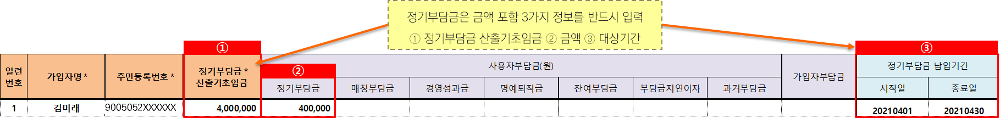

\- 정기부담금은 금액 뿐만 아니라 정기부담금 산출기초임금과 정기부담금 납입기간을 작성해야 합니다.

※ 당사는 부담금이 법정수준에 적정한지와 부담금 미납여부를 확인하기 위한 정보를

수집하고 있습니다.

2\) 정기부담금 외 사용자부담금 입금 방법

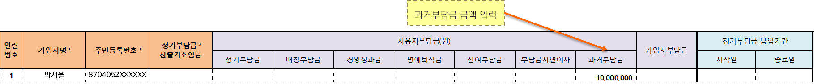

\- 정기부담금 외 다른 사용자부담금은 단순히 해당 부담금 유형 칸에 맞춰서 금액만 입력하면 됩니다.

3\) 정기부담금 & 가입자부담금 함께 입금

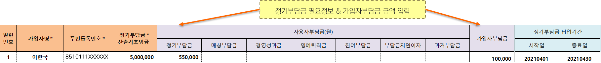

\- 먼저 정기부담금을 작성방법에 맞춰 입력한 다음 가입자부담금은 금액만 입력하면 됩니다.

**4. 부담금 납입 관련 유의사항**

가. DB, DC 공통

1\) 회사는 퇴직연금 신탁계좌에 부여된 은행 연계계좌번호로 입금

cf. 언번들(운용관리기관≠자산관리기관)의 경우 각 자산관리기관별 계좌로 입금

2\) 부담금 입금마감은 오후 4시이며, 마감시간 내 입금되지 않으면 당일처리 불가

나. DC

1\) 입금 전 부담금명부를 미리 이메일로 발송 (사무담당자웹 이용 시 생략)

2\) 부담금 입금 전 가입자별 운용지시 등록은 필수 → 신규 가입자에게 입금 전 운용지시 등록 안내

**5. 부담금 납입 처리결과 확인**

가. 알림톡과 이메일 자동발송

1\) DB

\- 입금일 익일 부담금 납입결과 **알림톡** 발송

\- 부담금 운용지시 상품 매수완료일+1영업일, 등록된 사무담당자 **e-mail로** 발송

2\) DC

\- 사무담당자 / 가입자 : 입금일 당일 18시 이후 부담금 납입결과 알림톡 및 **e-mail** 발송

나. 사무담당자웹에서 확인 가능

1\) HOME \> 업무신청 \> 부담금입금내역 조회

2\) HOME \> 업무신청 \> 증명서 발급 \> 부담금납입확인서

다. 미래에셋증권 담당자에게 아래 양식으로 신청 가능

1\) 부담금납입확인서

\- 퇴직연금 부담금 납입액\[비용인정 금액\] 확인용 (일시전환금, 가입자부담금 제외)

2\) 부담금납입내역서

\- 일자별 퇴직연금 부담금 납입내역 (모든 부담금 유형)

3\) 부담금 납입결과안내장

\- 납입건별 입금결과 (입금계좌정보, 입금액, 운용지시에 따른 상품매수결과 등)

**6. 가입자부담금 납입방법(DC)**

가. 가입자부담금 납입방법

1\) 부담금명부에 가입자부담금을 작성하여 처리

(미래에셋증권에 제출 혹은 사무담당자웹에서 직접 처리)

2\) 가입자별로 개설된 DC 가입자계좌로 직접 입금 (자동이체신청 가능)

cf. 납입한도 등록이 되어 있어야 하며 한도 내에서 입금 가능 (금융기관 합산 연 1,800원 한도)

\- 납입한도는 홈페이지, 모바일, 유선, 내점으로 변경 가능

나. 가입자부담금 납입 시 세액공제 혜택

1\) 세액공제 한도 적용기준 및 세액공제율

<table>
<colgroup>
<col style="width: 33%" />
<col style="width: 33%" />
<col style="width: 33%" />
</colgroup>
<thead>
<tr class="header">
<th>
총급여

(종합소득)
</th>
<th>
5천5백만원 이하

(4천5백만원 이하)
</th>
<th>
5천5백만원 초과

(4천5백만원 초과)
</th>
</tr>
</thead>
<tbody>
<tr class="odd">
<td>
세액공제율

(주민세 포함)
</td>
<td>16.5%</td>
<td>13.2%</td>
</tr>
<tr class="even">
<td>세액공제 한도</td>
<td colspan="2">
연금저축 단독 600만원

IRP 합산 900만원
</td>
</tr>
</tbody>
</table>

**7. 부담금 미납 안내(DC)**

가. 개요

\- 부담금이 제대로 납입되지 않는다면 직원들의 퇴직금 수급권이 위협받을 수 있습니다.

고용노동부나 금융감독원에서 퇴직연금 부담금 미납현황을 수시로 점검하고 있으며,

관련법 시행규칙에도 부담금 납입예정일로부터 1개월 이상 미납한 경우 10일 이내에

가입자에게 안내하게 되어 있습니다.

나. 부담금 미납안내

1\) 납입예정일 로부터 1개월 이상 미납된 경우 가입자에게 부담금 미납안내

※ 미납안내 기준 = 가입자의 정기부담금 납입기간 최종월 익월 + 납입주기(납입기일) + 1개월

2\) 미납 상태가 계속 지속되는 경우

매월 납입기일에 미납대상을 확인하고, 미납상태가 해소될 때까지

계속 안내장 발송

다. 미납 부담금 지연이자

\- 납입기일까지 부담금을 납입하지 않는 경우 지연일수에 대하여 지연이자를 납입하여야 함

(근로자퇴직급여 보장법 제20조 제3항)

\- 미납 부담금 지연이자는 사용자가 계산하여 납입

\<참고\> 미납 부담금에 대한 지연이자 이율(근로자퇴직급여보장법 시행령 제11조)

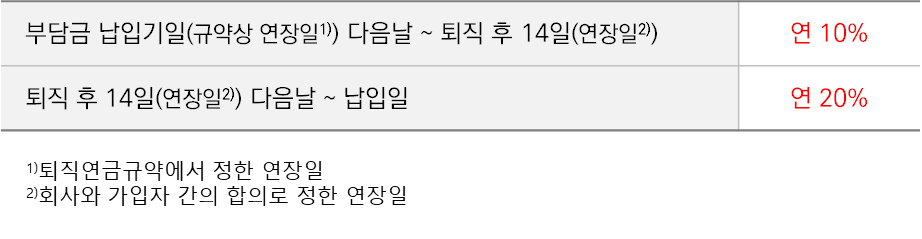

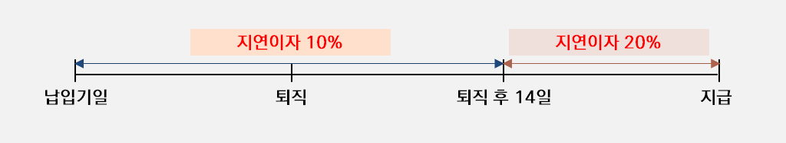

**8. 부담금 과소납 안내(DC)**

가. 개요

\- 금융감독원 경영유의사항 조치요구에 따라 사용자가 부담금을 적정한 수준으로 입금하고 있는지 확인하여 과소납이 발생한 경우 사용자에게 안내

나. 과소납 계산 방법

\- 정기부담금 산출기초임금을 기준으로 계산

\- 정기부담금이 산출기초임금의 1/12(퍼센트로 환산했을 때 8.33%)보다 작으면 과소납

다. 안내방법

\- 과소납 된 가입자가 발생한 경우 부담금 입금일 익영업일에 사무담당자 이메일로 발송하고,

입금일 + 6영업일에는 가입자 이메일 또는 우편으로 발송함

**9. \[참고\] 미래에셋증권 IRP계좌 퇴직금 입금방법**

가. 직원이 퇴직 시 미래에셋증권에서 개설한 개인형퇴직연금(IRP)로 이전을 요청한다면

퇴직금 지급은 꼭 퇴직금입금계좌번호 “IRP계좌번호 + 01”로 신청주시기 바랍니다.

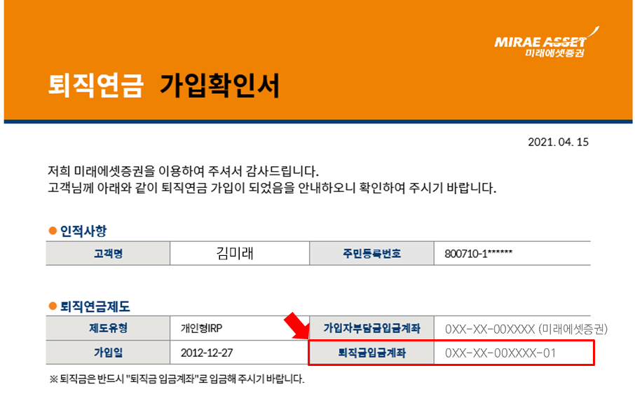

나. 유의사항

\- 미래에셋증권 IRP는 가입자부담금을 입금 받는 계좌와 퇴직금을 입금 받는 계좌가 다릅니다.

\- 위 가입확인서를 보시면 퇴직연금제도 정보에 계좌번호가 2개 표시되어 있습니다.

IRP계좌번호는 가입자부담금을 입금하는 용도로 사용되며, IRP계좌번호 뒤에 01을 붙인

퇴직금입금계좌는 퇴직금을 입금할 때 사용됩니다.

**1. DB 지급 종류**

가. DB (Defined Benefit)

> \- DB는 근로자에게 퇴직급여를 지급하기 위하여 사용자 즉, 회사가 퇴직금 재원을 금융기관에 적립하고 회사가 운용하다가, 정해진 퇴직급여를 지급하는 퇴직연금제도 중 하나
>
> \- 퇴직금 재원을 퇴직연금 사업자에게 회사가 적립 → 회사가 운용하며 운용수익 회사 귀속 → 지급사유 발생 시 확정된 퇴직금을 지급

나. DB 지급 종류

① 가입자퇴직 : 재직중인 직원이 퇴직할 때 퇴직처리

② 가입자 제도전환 : 가입되어 있는 퇴직연금 제도를 변경

③ 일부적립금이전 : DB제도에 적립한 금액의 일부를 복수사업자(타 사업자)로 이전

④ 계약이전 : DB제도에 적립한 전액을 타 사업자로 이전

**2. DB 퇴직**

가. DB 퇴직급여 지급절차

\[IRP 이전\]

\[일시금\]

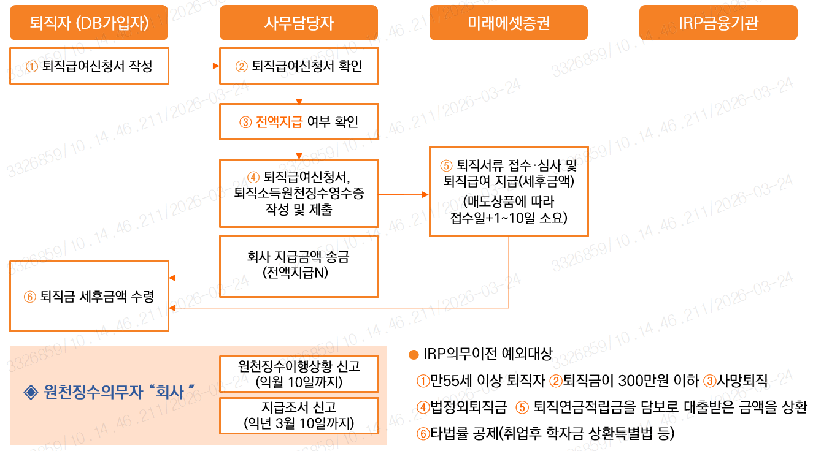

1\) 근로자의 퇴직신청서 작성

\- 퇴직신청서의 수령계좌는 IRP계좌, IRP가입확인서를 퇴직급여신청서와 함께 제출

2\) 사무담당자의 역할

① 퇴직자로부터 퇴직급여신청서와 IRP가입확인서 수령하여 DB사업자에 전달

② 퇴직자에 대한 퇴직소득원천징수영수증 작성하여 IRP계좌의 사업자에게 FAX 송부.

DB사업자 지급분 외 회사지급금액이 있는 경우, IRP계좌로 지급금액 송금

3\) DB사업자

\- 퇴직급여신청서에 대한 검토를 마친 후 지급업무를 수행, 지급금액을 IRP계좌로 송금.

4\) IRP사업자

\- 원천천징수영수증을 수령, 과세이연 내역을 계좌정보에 입력한 후 부담금 입금.

나. DB 지급 시 유의사항

1\) DB 제도의 원천징수의무자 : 회사\[소득세법시행령 제 184조의 3\]

\- 원천징수의무자로서, 원천징수이행상황 신고 (익월 10일까지) 및, 지급조서 신고 (익년 3월 10일까지)

2\) IRP의무이전 예외사유를 제외하고 퇴직자의 퇴직금은 IRP로 의무이전

\*IRP의무이전 예외사유

> ① 만 55세 이상 퇴직자, ② 퇴직금이 300만원 이하, ③ 사망으로 인한 당연 퇴직, ④ 법정 외 퇴직금
>
> ⑤ 퇴직연금(DB/DC) 적립금을 담보로 대출받은 금액을 상환, ⑥ 타법률 공제(취업 후 학자금 상환 특별법 등)

참고) 퇴직신청서 sample

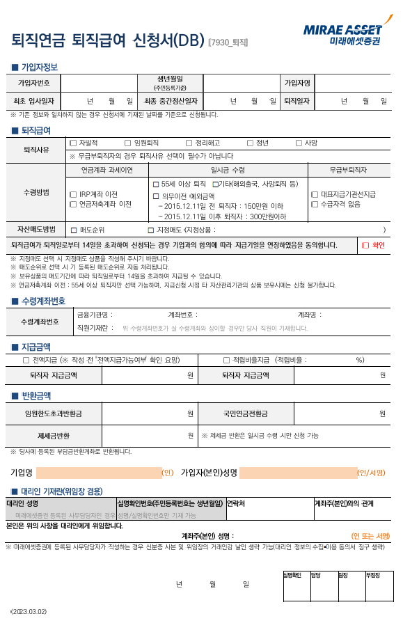

① 가입자정보 → 가입자정보 및 근속정보 작성

② 퇴직사유 및 수령방법 체크

→ IRP이전, 연금저축계좌이전인 경우 가입(계좌)확인서 필수

→ 무급부퇴직인 경우 가입자서명 불필요

→ 매도상품 있는 경우 상품기재 필수

→ 퇴직일로부터 14일 초과하여 신청 시 지급기일 연장 동의 필수

③ 수령 계좌번호 → 수령 받을 계좌번호 기재

④ 지급금액 → 전액지급 / 비율지급 여부 체크 및 지급금액 기재

⑤ 반환금액 → 반환금 있는 경우 기재

※ 회사 사용인감 날인 및 가입자 서명 필수

**3. DB 이전/해지**

가. 개요

\- DB퇴직 외에 DB제도에서 발생할 수 있는 지급종류별 내용

나. 퇴직 외 지급종류

1\) 제도전환(DB→DC)

\- 임금피크제(급여인상률 낮은 고직급자 포함), 회사 정책 상 제도전환, 중도인출 등을 위하여

DB제도의 가입자들이 DC제도로 전환 요청하는 경우 발생할 수 있는 지급종류

2\) 계열사 전출입(가입자이전)

\- 퇴직연금 적립금은 이전 받을 사업자계좌로 직접 이체 (적립비율지급)

① (DB→DB이전) 사내적립금 지급방법은 전출사, 전입사 간 상호 협의 사항

② (DB→DC이전) 사내적립금도 이전 받을 사업자계좌로 직접 이체 (DC는 100% 사외적립의무)

3\) 일부적립금 이전

\- 복수사업자간 적립금만을 이전할 경우 발생하는 지급종류. 동일법인의 일부 적립금 이전은

퇴직연금 계약이전 간소화, 전문화로 업무가 진행되기 때문에 하나의 사업자에만 서류를 제출

\- 동일법인의 이전은 실물이전, 현금이전 중 선택 가능

\- 적립비율 150% 초과 시, 초과분만 사용자 반환 가능

4\) 계약이전(전부적립금 이전)

\- DB형 퇴직연금의 사업자 변경. 합병이나 분사 등의 이슈로 인하여 발생

\- 동일 제도, 동일 법인간 이전하는 경우 보유상품 매도 없이 실물이전 가능

\- 언번들계약은 접수신청일 다음날 매도 신청(번들계약보다 1일 더 소요)

(언번들계약 : 자산기관, 운용기관이 상이한 계약)

\- 수수료 납입완료 후 계약이전 완료

\- 계약이전 후 기존계약은 종료

다. 유의사항

\- 지급종류별 징구 서류와 업무처리방법이 다르기 때문에 업무진행 전 해당업무가 어떤 지급종류에

해당하는지 사업자 통해서 확인 필요

\- 계약이전 간소화 및 전문화는 동일사업자번호의 동일법인간 일부적립금 이전 or 계약이전만 가능

**4. DB 재정검증**

가. 개요

\- DB 지급에 영향을 미칠 수 있는 재정검증에 대한 내용 설명

나. DB 재정검증

1\) 재정검증이란?

\- 퇴직연금사업자가 회사 DB제도의 적립금이 법정 최소적립금 이상인지를 매 사업연도 말을 기준으로

확인하는 것

2\) 적립의무

\- DB제도를 설정한 사용자는 급여지급능력을 확보하기 위하여 매 사업연도 말 기준책임준비금에

최소적립비율을 곱하여 산출한 금액 이상을 적립금으로 적립하여야 함

재정검증 결과 적립비율 : 2022년 이후 최소적립비율은 100%

3\) 재정검증에 대한 퇴직연금 사업자의 의무

\- 퇴직연금사업자(복수사업자일 경우, 간사기관)가 매 사업연도 종료 후 6개월 이내 재정검증을

수행 후 그 결과를 회사에 통보해야 한다. (근로자퇴직급여 보장법 제16조 및 동법 시행령 제22조)

\- 재정검증결과가 최소적립기준금액 미달 시 적립금의 부족여부, 적립금 및 부담금 납입현황,

> 적립금 부족해소 현황 등을 사용자(회사)에게 서면으로 안내 함

**5. DB 재정검증에 따른 지급**

1\) DB재정검증결과에 따른 DB지급방법 : 전액지급 / 비율지급

\- 재정검증결과 적립비율이 100% 보다 크거나 같으면 전액지급이 가능

\- 전액지급 단체라고 하더라도 전액지급 예외사유가 발생하게 되면 비율지급으로 진행

(Ex. 지급 누계비율 25% 초과)

\- 재정검증결과 적립비율이 100% 보다 작다면 비율지급

2\) DB지급방법 상세

① 전액지급 : DB사업자가 퇴직급여 총액을 지급하고 회사에서는 사외적립금 지급이 없는 방식

② 비율지급 : DB사업자가 퇴직급여추계액에 적립비율을 적용하여 지급하고, 그 외 부분에 대해서는

회사가 지급하는 방식

③ 대표지급 : 특정 퇴직연금사업자가 전액 지급하도록 하는 방법

(퇴직급여신청서에 대표지급기관 표기, 대표지급기관 외는 무급부퇴직 처리)

④ 각사지급 : 복수 퇴직연금사업자가 적립비율에 해당하는 금액에 회사 보유분을 안분하여 지급하거나

> 회사보유분은 특정 퇴직연금사업자가 합산하여 지급하는 방법
>
> (퇴직급여신청서에 사업자별 지급액 표기)

3\) DB 지급누계비율

① 지급누계비율이란?

\- 사업연도 개시일 이후 가입자에게 지급한 금액을 합산하여 해당 법인의 적립금기준으로 지급비율이

어느 정도인지를 계산하는 것

② DB지급누계비율 25% 이상

\- 지급누계비율이 25% 이상이라면 전액지급으로 진행하고 있었다 하더라도

지급누계비율이 25%에 도달한 시점에서 적립비율을 산정하여 가입자에게 동일한 비율로 지급

\- 퇴직자가 다수 발생하는 경우 늦게 지급받는 가입자가 불리해지는 일이 발생하지 않도록 하는 조치

\[확정급여형 재정검증 및 처리지침 정리 2021.1.11 퇴직연금 복지과\] 지침 명시 사항

\- DB사업자가 복수일 경우, 간사기관을 통해 회사 전체의 지급누계액을 파악해야함

4\) 유의사항

1\) 퇴직급여 지급액(R)은 퇴직자의 퇴직급여 예상액(A)에 대해 적립비율(B)만큼 계산하여 지급(R=A×B)

2\) 재정검증 시 적립비율이 100%를 초과하면 전액지급원칙에 따름

3\) 재정검증 시 적립비율이 100%보다 작은 경우에는 재정검증 시 적립비율에 따라 지급

4\) 재정검증 시 100%를 초과하여 전액 지급하던 중 전액지급 예외사유 발생 시(ex. 지급누계

비율 25% 초과 등), 그 첫 사유 발생 시점에서 적립비율을 산정하여 이후 동일한 비율 지급

**6. 퇴직소득세 환급 방법과 절차**

가. 개요

\- DB퇴직 시 IRP의무이전 대상이 아닌 퇴직자나 명예퇴직금을 급여계좌로 지급받은 퇴직자가

60일 이내에 과세이연 신청을 하게 되면 퇴직소득세 환급의 업무가 발생

나. 환급 방법과 절차

1\) 퇴직소득세 환급 업무순서

① 일시금으로 퇴직금을 수령한 퇴직자가 수령일 기준 60일 이내에 세후 퇴직급여를 IRP계좌로 입금

(입금금액은 세후 퇴직급여의 100% or 일부금액 가능)

② 입금 후 국세청 양식 과세이연계좌신고서를 작성합니다.

③ IRP사업자는 가입자 자필로 작성한 과세이연신고서와 IRP계좌 사본, 입금증 등을 첨부하여

원천징수의무자에게 퇴직소득세 환급요청 전달

④ 환급요청을 전달받은 원천징수의무자인 회사는 해당 퇴직자가 납부한 퇴직소득세 및 지방소득세를

환급하여 IRP계좌로 송금

⑤ 환급업무는 회사의 자금으로 먼저 집행한 후 익월 원천세에서 공제

⑥ 세금을 환급해준 후 과세이연된 내용이 반영된 퇴직소득원천징수영수증을 새로 발급하여

국세청에 신고함과 동시에 IRP 기관으로 발송

**7. 퇴직소득세 세액정산 특례**

가. 개요

\- DB퇴직처리 시 중간정산한 내역이 있는 가입자에 대해 유불리를 따져서 세액정산 특례를 적용하는

방법

나. 세부내용

1\) 세액정산 특례란?

\- 사용자가 같은 하나의 근로계약에서 퇴직연도 이전에 중간지급을 받은 경우,

퇴직시점에 중간지급액을 최종 퇴직소득과 합산하여 세액을 계산한 후

최종분 퇴직소득으로만 계산된 세액과 비교하여 유리한 것을 선택하는 세액계산

단, 동일연도 퇴직소득(중간정산/중도인출포함)은 금번 퇴직/중도인출 지급 건과 강제합산하여 세액계산

2\) 사용자가 같은 하나의 근로계약이란?

① 직원이 임원으로 승진하면서 퇴직금을 받은 경우

② 직원으로 재직 중 중간정산 또는 DC중도인출 한 경우

③ 직∙간접으로 출자관계에 있는 법인으로 전출하면서 퇴직금을 받은 경우

④ 합병∙분할 등 조직변경, 사업양도 등으로 퇴직금을 받은 경우

⑤ 상근임원이 비상근임원이 되어 퇴직금을 받은 경우

3\) 예시

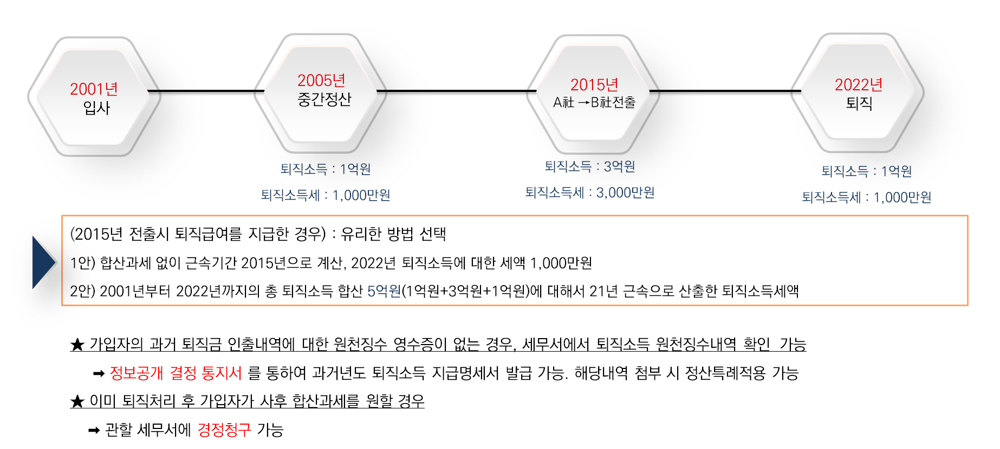

**1. DC 지급 종류**

가. DC (Defined Contribution)

\- DC는 근로자에게 퇴직급여를 지급하기 위하여 사용자 즉, 회사가 매년 1회 이상 정기적으로 확정된

부담금을 근로자의 DC 계정에 납입하고 근로자가 직접 운용하는 퇴직연금제도 중 하나

\- 정해진 부담금을 퇴직연금 사업자에게 회사가 적립 → 근로자가 직접 운용하며 운용수익도 근로자에게

귀속 → 지급사유 발생 시 퇴직연금 사업자는 근로자가 적립한 퇴직금을 지급

나. DC 지급 종류

① 퇴직으로 인한 지급

② 근로자퇴직금여 보장법에서 정하는 사유와 요건을 갖춘 경우 중도인출로 인한 지급

③ 가입자이전

④ 사업자이전

⑤ 계약이전

**2. DC 퇴직**

**가.** DC 퇴직급여 지급절차

① 근로자

\- 근로자가 퇴직급여신청서를 작성 → IRP 계좌 가입확인서 제출

② 사용자(회사)

\- 신청한 서류의 내용 확인 → 퇴직급여신청서와 IRP 가입확인서를 퇴직연금사업자에 제출

→ 부담금 외에 잔여부담금과 추가지급금 등 근로자의 DC 계좌에 납입 →

퇴직연금사업자에게 퇴직금 지급 청구

③ 퇴직연금사업자

\- 회사가 제출한 서류를 심사 및 접수 → 근로자는 운용하고 있는 금융상품을 매도(동일한 퇴직연금 사업자 IRP시 현물이전 가능) → 연금계좌원천징수영수증 및 지급명세서 작성 및 발송

→ IRP계좌로 세전 퇴직급여 입금

④ IRP통장

\- IRP사업자는 과세이연 접수 및 입금처리 → 해지(인출) 또는 만 55세 이후 연금수령(연금수령 시 절세 가능)

※ IRP 의무이전 예외사유

\- 만 55세 이후 퇴직하는 경우

\- 퇴직급여액이 300만원 이하인 경우

\- 사망으로 인한 당연 퇴직의 경우

\- 출입국관리법 시행령 제23조제1항에 따라 한시적 체류자격으로 국내에서 근로를 제공하고 퇴직한

근로자로서 퇴직과 함께 해외로 출국한 경우

\- 다른 법률에서 급여의 일부 또는 전부를 공제하도록 한 경우

※ 원천징수영수증 누가 발행하는가?

\- DB제도 & 퇴직금제도 : 원천징수의무자는 사용자(회사)

\- DC제도 : 금융회사와 사용자간 원천징수 의무 대리 또는 위임의 관계에 있기 때문에 DC사업자

나. DC 지급 시 유의사항

> ① 퇴직월에 추가로 납부해야 할 잔여부담금 확인 필요 (퇴직처리 이후 잔여부담금이 확인된 경우 재퇴직 신청 가능)
>
> ② DC는 가입자별로 적립, 운용되므로 회사가 퇴직급여를 직접 지급할 경우 회사 반환이 불가하므로 반드시 지급되어야 함

③ 사내대출이 있는 경우에도 DC 퇴직급여는 IRP로 전액 지급되어야 함(IRP 송금위임 활용)

④ 계속 근로기간 1년 미만인 가입자는 퇴직급여를 청구할 수 없으며, 적립금은 사용자(회사)에 귀속

(규약에 명시되어 있으면 지급 가능)

⑤ 임원 퇴직 시, 임원 퇴직소득한도 초과금액 사용자계좌로 반환 → 회사에서 근로소득으로 과세 후 지급

⑥ 퇴직소득 세액정산특례 : 중간 지급된 퇴직소득과 지급할 퇴직소득을 합산하여 퇴직소득세 정산 가능

(근속연수를 통산하고 중간 지급 시점에 기납부한 퇴직소득세액 차감)

⑦ 강제 합산과세 : 퇴직연도와 동일연도에 지급이 있을 경우 무조건 합산과세

⑧ 선택 합산과세 : 퇴직연도 이전 지급분에 대해 합산하여 정산시와 미정산시 비교하여 유리할 경우

선택하여 적용

※ 세액정산특례 가능한 사유는?

\- 재직 중 중간정산 또는 중도인출한 경우

\- 직원이 임원으로 승진

\- 임금피크제를 시행하면서 정산

\- 회사의 합병∙분할 등 조직변경∙사업양도로 정산

\- 출자관계 법인으로 전출

\- 상근임원이 비상근임원이 된 경우

\- 비정규직에서 정규직으로 전환

> ※ 가입자의 과거 퇴직금 인출내역에 대한 원천징수영수증이 없는 경우, 세무서에서 퇴직소득 원천징수내역 확인 가능 → 정보공개 결정 통지서를 통하여 과거연도 퇴직소득 지급명세서 발급 가능, 해당내역 첨부 시 정산특례적용 가능
>
> ※ 이미 퇴직처리 후 가입자가 사후 합산과세를 원할 경우 → 관할 세무서에 경정청구 가능(또는 가입자가 당사 지점에 내점하여 신청 or 회사에서 사후처리요청 가능)

**다.** 명예퇴직급여 지급 방법

1\) 법정 퇴직급여 : IRP 의무이전 대상(만 55세 전 퇴직 & 퇴직급여 300만원 초과)

\* 만 55세 이후 퇴직인 경우 IRP수령 후 연금저축계좌로 이전 가능

2\) 법정 외 퇴직급여 : IRP 의무이전 대상 아님(일반계좌 or IRP or 연금저축으로 선택 지급 가능)

\* 단, IRP로 지급 시 일부해지가 불가능함에 유의

\[명예퇴직급여 DC 계좌로 입금 시\]

• DC 사업자가 명예퇴직금과 기존 DC 적립금을 합산하여 일괄 지급 & 원천징수까지 완료

• 퇴직자는 법정 외 퇴직금도 IRP로 강제 이전 대상으로 수령방법 선택 불가

• 일부금액이 필요해도 전액 해지해야 함

\[명예퇴직급여 급여계좌로 입금 시\]

• 회사가 원천징수의무자로 세금계산, 원천징수영수증작성, 지급명세서 신고 등 모든 세금관련 업무 직접 처리. ‘퇴직소득원천징수영수증’ 작성하여 퇴직 신청 시 DC 사업자에 퇴직급여신청서와 함께 송부 → DC 사업자는 ‘세액정산’ 의무 수행

• 퇴직자는 수령방법을 선택 가능 (일시금 수령 or IRP이전)

• 법정퇴직금은 과세이연하고 법정외퇴직금은 일시금 수령하여 자금 활용

**3. DC 중도인출**

가. 개요

\- 근로자퇴직급여보장법 시행령 제 14조에 의하여 정해진 사유와 요건을 갖춘 경우에는 중도인출 가능

나. 중도인출 신청 절차

① 근로자 : 중도인출사유 확인 및 증빙서류 준비 -\> 중도인출신청서 작성 및 제출

② 사용자(회사) : 신청서 및 증빙서류 확인 -\> 퇴직연금 사업자에 서류제출

③ 퇴직연금 사업자 : 서류심사 -\> 고객 보유상품 매도 -\> 퇴직소득세 과세 후 가입자 지급

다. 중도인출 사유와 요건

1\) 무주택자 주택구입

① 중도인출 사유 : 무주택자인 가입자가 본인 명의로 주택을 구입하는 경우(부부 공동명의 가능)

② 신청가능 시기 : 매매계약 체결일부터 소유권이전 등기 후 1개월 이내 신청가능

③ 구비서류

\- 현재 거주하는 곳을 소유하고 있지 않고 무주택자임을 확인하는 서류를 제출,

현거주지 주민등록등본, 주민등록등본주소지의 건물등기사항증명서, 지방세 세목별 과세증명서(전국단위&재산세(주택)분 발급)

\- 매매계약서(사본) / 분양계약서(사본) or 공급계약서(사본) or 분양권매매계약서(사본)

\* 매매계약서(사본) : 주거용 여부 확인 가능할 것

(상가, 무허가 건물매수, 증여/상속으로 소유권 변경 시 불가)

\- 분양계약서(사본) or 공급계약서(사본) or 분양권매매계약서(사본)

\* 권리의무승계내역 포함 계약서 전체 필요

\- 신축 : 공사계약서(사본) 필요 / 건축허가서 or 착공신고필증 등 유효

\- 경매/공매 : 입찰보증금 입금영수증(사본,보증보험증권도 유효) / 경매,공매 사건 검색 인터넷 발급본

/ 경매-대금지급기한통지서(사본) / 공매-매각결정통지서(사본)

\- 보유주택 매도 후 주택매수시 : 매도계약서 or 소유권이전등기 확인되는 건물등기사항증명서

④ 과세 : 중도인출 사유에 해당된다면 퇴직금에 대해서는 퇴직소득세를 차감 후 지급

⑤ 유의사항

\- 신청서 작성일 기준 무주택자 시점이어야 하며, 매도잔금일과 매수잔금일은 최소 1일이상 차이나야 함

(계약일 아닌 잔금일 기준임)

\- 오피스텔의 구입 : 건축물관리대장상 건축물 용도가 주거용으로 명시되어 있거나, 주택으로 인정되어 과세(재산세 납세)된 주거용 오피스텔을 구입하는 경우에는 허용

\- 서류 발급기한 : 주민등록등본, 초본 3개월(창구,인터넷,무인발급 동일) / 등기부등본(건축물대장) 1개월

2\) 무주택자 주거목적 전/월세 보증금

① 중도인출 사유 : 주거목적으로 전세금 및 임차보증금을 부담하는 경우

② 신청가능 시기 : 매매계약 체결일부터 잔금지급일 후 1개월 이내

③ 구비서류

\- 현재 거주하는 곳을 소유하고 있지 않고 무주택자임을 확인하는 서류를 제출

현거주지 주민등록등본, 주민등록등본주소지의 건물등기사항증명서, 지방세 세목별 과세증명서(전국단위&주택부분 발급)

\- 전월세계약서 또는 임대차 계약서(사본)

④ 과세 : 중도인출 사유에 해당된다면 퇴직금에 대해서는 퇴직소득세를 차감 후 지급

⑤ 유의사항

\- 가입자 본인은 무주택자이며 배우자명의 전세계약 시 향후 전입신고 등을 통해 해당 주택에

함께 거주함을 증명할 것을 서약하는 문서(서약서) 및 주민등록등본으로 동거여부, 가족관계 확인 필요

\- 전∙월세 사유로 중도인출은 해당 사업장 재직 중 1회만 가능

\- 기존계약의 연장계약시에는 보증금 인상분이 있어야 신청가능(월세금만 인상 시 불가)

\- 전∙월세 보증금에 대한 중도인출이며 월세금만 있는 계약은 신청 불가

\- 가입자의 배우자, 직계존비속, 형제자매 명의의 계약 : 가족명의 계약시 주민등록등본 등을 통해 동일 세대임을 증빙하는 경우 중도인출 허용(그 외 타인 명의계약은 중도인출 불가)

3\) 본인 및 배우자 등 부양가족의 6개월 이상 요양

① 중도인출 사유 : 가입자가 부담한 의료비 총액이 직전연도 연간임금총액의 12.5%초과하는 경우

② 신청가능 시기 : 요양사유 확인일부터 요양종료일로부터 1개월

③ 구비서류

\- 진단서 또는 소견서상 6개월 이상 요양 치료가 필요하는 내용이 명시 (암,불치병 등 병명으로 불가)

\*건강보험산정 특례대상자인 경우 6개월 기간 명시 없어도 되며, 건강보험산정 특례대상자임을 확인

\- 연간 임금총액 확인서류 : 전년도 근로소득원천징수영수증 or 전년도 급여명세서

> 단, 중도인출 신청일로부터 전년도 연간임금총액보다 직전 1년간의 연간임금총액이 더 낮은 경우

신청일 기준 직전 1년간 지급 받은 급여명세서

\- 의료비 지출 증빙 (직전 1년간의 의료비 지출액 + 지출이 예정되는 금액)

\*의료기관 발행 : 진료비계산서/영수증/간이 외래진료비계산서/진료비(약제비)납입확인서/

진료비세부산정내역/약제비 계산서, 영수증

\*지출이 예정되는 의료비 : 의료기관 발행 청구서 / 견적서

④ 기타사항

\- 부양가족 범위 : 가족관계증명서 또는 주민등록등본으로 확인(배우자, 본인 및 배우자의 직계존속,

> 직계비속, 형제자매(배우자의 연령 제한 없음, 직계존속 만 60세 이상, 직계비속 만20세 이하, 형제자매 만 60세이상 또는 만20세 이하)

\- 부양가족 확인 : 가족관계확인은 가족관계증명서 or 주민등록등본으로 확인

\- 서류 발급기한 : 주민등록등∙초본 3개월(창구/인터넷/무인발급), 가족관계증명서 3개월, 진단서 6개월,

근로소득원천징수영수증.보수총액신고서/직전연도.소득금액증명원/직전연도.건강보험자격득실확인서

3개월

\- 중도인출 가능 금액 : 전액 또는 일부 가능

\- 치료/요양 : 재활치료, 통원치료, 약물치료, 인정가료, 요양 가능(훈련, 관찰, 검사, 관리, 검진 등 불가)

\- 간병비 영수증, 발달치료센터 지출비는 중도인출 사유 체크를 위한 의료비로 인정 불가

4\) 개인회생 절차 개시결정, 파산선고

① 중도인출 사유 : 개인회생 절차 개시결정, 파산선고

② 신청가능 시기

\- 개인회생 : 개인회생절차개시 결정을 받은 날로부터 5년 이내

\- 파산선고 : 파산선고를 받은 날로부터 5년 이내

③ 구비서류

\- 최근5년 이내 ‘회생절차 개시결정문(사본) or 개인회생절차 변제인가 확정증명원＇ 등

회생절차 개시결정 여부를 확인할 수 있는 서류

\- 나의 사건검색 출력물(대법원 홈페이지, 진행경과 전체로 출력)

\- 최근 5년 이내 파산선고문(사본)

\- 서류 발급기한 : 나의 사건 검색출력물 1개월이내

④ 기타사항

\- 최근 5년 이내이면 여러 번 중도인출 신청 가능

\- 폐지결정, 면책결정 시에는 개인회생 효력이 종료되었으므로 신청 불가

\- 개인워크아웃제도 또는 신용회복은 중도인출 불가

\- 나의 사건검색 출력물 출력방법

.대법원 홈페이지 ‘www.scourt.go.kr’ 접속 대국민서비스 \> 정보 \> 사건검색 \> 나의사건검색

(사건번호 검색으로 누구나 출력가능) \> 진행경과 ‘전체’로 출력

5\) 재난으로 피해

① 중도인출 사유 : 재난으로 인한 피해

② 재난의 종류 : 자연재난 또는 사회재난(재난 및 안전관리 기본법 제32조 제1호에 따른 재난)

\*사회재난은 특별재난지역이 선포된 사회재난에 한하여 중도인출 가능(행정안전부 홈페이지 확인 가능)

③ 신청가능 시기

\- 물적피해 : 피해발생일로부터 3개월 이내

\- 인적피해 : 의료행위 종료 후 3개월 이내 또는 실종 상태 유지기간 내 신청

④ 구비서류

\- 물적피해 : 건축물대장등본, 피해상황확인서, 중앙재난안전대책본부의 특별재난지역 선포 확인자료 및

주거비 지원내역

\- 인적피해 : 입원치료 시 - 진단서, 소견서 등 15일 이상 입원치료 증빙 자료 (감염병의 경우 입원,

격리통지서, 진료확인서 등) / 실종 시 - 실종신고접수증, 사건사고사실확인서

⑤ 유의사항

\- 코로나바이러스감염증-19로 중도인출은 감염병으로 가입자 본인이 15일이상 입원 치료 증빙하는 경우

가능 (근로자퇴직급여 보장법 시행령 제14조, 제18조 일부개정 2020.11.3)

**4. DC 이전**

**가. 가입자 이전**

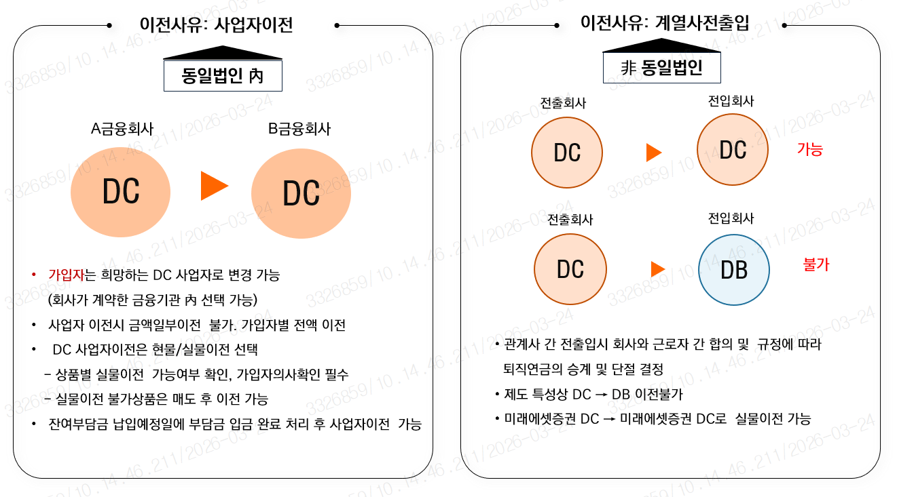

1\) 개요

\- 근로자는 가입하고 있는 퇴직연금을 규약에서 정해진 퇴직연금 사업자 안에서 제도전환 가능

2\) 제도 전환

\- DB에서 DC로 가능

\- 전환 전 DB적립금도 DC제도로 소급되어 제도전환 후에는 DC만 운용

\- 중도인출을 위하여 DB에서 DC로 제도전환 후 중도인출이 가능

3\) 계열사 전출입

\- 근로자간 합의 및 규정에 따라 퇴직연금의 승계 및 단절을 결정

\- 전출회사 DC -\> 전입회사 DC로의 이전 가능 / 전출회사 DC -\> 전입회사 DB 이전 불가

\- 미래에셋증권 DC에서 미래에셋증권 DC로 이전 시 현물이전 가능

4\) 동일법인 내 사업자이전

\- 동일 제도, 동일 법인 간 이전은 타사 이전 시 실물이전 가능

\- 당사 내 이전은 비동일 법인도 실물이전 가능

**나. 계약 이전**

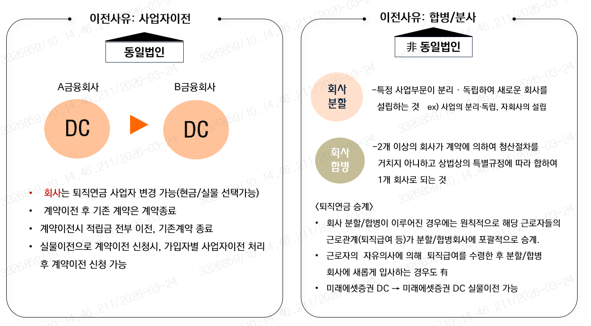

1\) 사업자이전

\- 근로자는 재직하면서 다른 DC사업자로 금융기관을 변경

\- 회사가 계약한 금융기관 중에서만 선택

\- 동일 제도, 동일 법인일 경우 실물이전 가능

2\) 계약이전

\- 회사가 퇴직연금 사업자를 변경

\- DC 계약이전 후에는 기존계약은 계약이 종료

\- 수수료 납입완료 후 종료가 가능하며 적립금 전부 계약이전으로 진행

\- 실물이전으로 계약이전 원할 경우, 가입자 별 실물이전 선행

3\) 유의사항

\- 근로자가 원리금 보장상품에 가입되어 있다면 중도해지에 따른 금리 패널티 발생 가능

(해지 이율을 확인 후 이전 진행)

※ 첨부자료 : 중도인출 사유 별 징구 서류 목록

\[무주택자인 가입자의 주택 구입 또는 전월세 계약\]

<table>
<colgroup>
<col style="width: 10%" />
<col style="width: 8%" />
<col style="width: 21%" />
<col style="width: 59%" />
</colgroup>
<thead>
<tr class="header">
<th colspan="2"><strong>구분</strong></th>
<th><strong>서류명</strong></th>
<th><strong>세부사항</strong></th>
</tr>
</thead>
<tbody>
<tr class="odd">
<td colspan="2" rowspan="3">무주택자</td>
<td>현거주지 주민등록등본</td>
<td>
· 외국인등록증 소지자인 경우는 외국인등록사실증명서

· 국내거소신고증 소지자인 경우는 국내거소신고사실증명서
</td>
</tr>
<tr class="even">
<td>
주민등록등본 주소지의

건물등기사항증명서
</td>
<td>
· 등기사항증명서 대신 주민등록등본주소지의 건축물대장

(소유주표시) 첨부 가능
</td>
</tr>
<tr class="odd">
<td>지방세 세목별 과세증명서</td>
<td>
· 지역 : 전국자치단체, 세목 : 재산세(주택)으로 발급

· 재산세(주택)납부사실이 있는 경우 : 납부지역 이외 전지역의 지방세 세목별 과세증명서 재산세(주택) 발급 및 해당 주소지 매도계약서 or 건물등기사항증명서
</td>
</tr>
<tr class="even">
<td rowspan="4">
주택

구입
</td>
<td>구입</td>
<td>매매계약서(사본)</td>
<td>
· 주거용(주택, 아파트, 주거공용면적 등) 여부 확인 가능할 것 (용도 확인 불가할 경우 매수주택의 건축물대장 추가 징구하여 주거용 여부 확인)

· 업무용오피스텔, 상가 등 주거용건물이 아닌 경우는 중도인출 불가

· 무허가 건물 매수, 증여/상속으로 소유권 변경하는 경우 중도인출 불가
</td>
</tr>
<tr class="odd">
<td>분양</td>
<td>
분양계약서(사본) or

공금계약서(사본) or

분양권매매계약서(사본)
</td>
<td>· 권리의무승계내역 포함 계약서 전체 필요 (전매제한기간&amp;해당내용 확인 시 권리의무승계내역 생략가능)</td>
</tr>
<tr class="even">
<td>신축</td>
<td>공사계약서(사본)</td>
<td>· 건축허가서 or 착공신고필증 등 유효</td>
</tr>
<tr class="odd">
<td>
경매

공매
</td>
<td>
입찰보증금 입금영수증

(사본)

경매/공매 사건 검색 인터넷 발급본
</td>
<td>
경매 - 대금지급기한통지서 (사본)

공매 - 매각결정통지서 (사본)

· 입찰보증금 입금영수증 대신 보증보험증권 유효
</td>
</tr>
<tr class="even">
<td colspan="2">전월세 계약</td>
<td>
임대차계약서(사본)

or 전월세계약서(사본)
</td>
<td>
· 신규/연장계약 모두 가능

· 전/월세보증금에 대한 중도인출이며 월세금만 있는 계약은 중도인출 불가

· 기존계약의 연장계약 시에는 보증금 인상분이 있어야 신청 가능(월세금만 인상은 신청불가)
</td>
</tr>
</tbody>
</table>

\[본인 및 배우자 등 부양가족의 6개월 이상 요양\]

<table>
<colgroup>
<col style="width: 16%" />
<col style="width: 23%" />
<col style="width: 59%" />
</colgroup>
<thead>
<tr class="header">
<th><strong>구분</strong></th>
<th><strong>서류명</strong></th>
<th><strong>세부사항</strong></th>
</tr>
</thead>
<tbody>
<tr class="odd">
<td>
*6개월 이상 요양

의료행위 증빙
</td>
<td>진단서(소견서) or 건강보험공단의 장기요양확인서(인정서) 등 병명 및 치료기간이 명시된 객관적치료기록</td>
<td>
· 진단서(소견서) 상 '6개월 이상 요양(치료) 필요' 내용이 명시될 것 (암, 불치병 등 병명으로 불가)

· 국내의사면허가 있는 의사, 한의사가 발급한 진단서일 것

(미용목적 불가, *치료/요양 목적이어야 할 것)

· 건강보험산정특례대상자인 경우 6개월 기간 명시 없어도 되며, 진단서(소견서) 상 건강보험산정특례대상자임이 확인 될 것
</td>
</tr>
<tr class="even">
<td rowspan="2">연간 임금총액</td>
<td>
[재직1년 이상]

전년도 근로소득원천징수영수증 or (산재보험/고용보험)전년도 보수총액신고서 or 전년도 급여명세서
</td>
<td>· 가입자가 부담한 의료비 총액이 직전연도 연간임금총액의 12.5% 미초과 시 중도인출 불가</td>
</tr>
<tr class="odd">
<td>
[재직1년 미만 &amp; 수급자격Y]

재직 중 월별 급여명세서 or 월평균 급여를 확인할 수 있는 객관적서류
</td>
<td>
· 재직 중 지급 받은 급여명세서로 연간임금총액 산출

(연간임금총액=월급여 평균액x12)
</td>
</tr>
<tr class="even">
<td rowspan="2">
의료비지출 증빙

(직년 1년간의 의료비 지출액 + 지출이 예정되는 금액)
</td>
<td>
[①지출한 의료비]

&lt;의료기관 발행&gt;

진료비계산서·영수증,

간이외래진료비계산서,

진료비(약제비)납입확인서,

진료비세부산정내역,

약제비계산서·영수증

&lt;장기요양기관 발행&gt;

장기요양급여비용명세서, 장기요양급여비납부확인서
</td>
<td>
· 중도인출 신청일 기준 직전 1년간의 의료비 지출액 인정 (지출일(=수납일) 없는 경우 통상 진료일에 계산하므로 진료일로 판단,

· 의료기관에서 발급한 영수증/확인서 없이 카드전표, 현금영수증 등 지출자료만 제출하는 경우 증빙서류로 인정불가

· 진단서(소견서) 등 의료행위 증빙서류는 환자의 인적사항과 질병번호가 동일해야 함
</td>
</tr>
<tr class="odd">
<td>
[②지출이 예정되는 의료비]

의료기관 발행 청구서,

견적서
</td>
<td>
· 중도인출 신청일 기준 이전 1개월 이내 발급자료만 인정

※향후의료비추정서 불가

· 의료기기구입/임차에 대한 견적서의 경우 '장애인보장구사용이 필요하다는 내용의 진단서(병원발행), 보장구 처방전, 보장구 검수확인서' 등을 추가 증빙
</td>
</tr>
</tbody>
</table>

> ※ 연간임금총액보다 의료비지출금액(①+②)이 12.5%를 초과해야만 중도인출 신청가능
>
> (①의 서류로 이미 충족했다면 ②의 서류는 증빙필수 아님 다만, 요양인출 한도 적용 추가필요 시 의료비지출내역
>
> 최대 증빙 필요)

\[개인회생 절차 개시결정, 파산선고\]

<table>
<colgroup>
<col style="width: 14%" />
<col style="width: 26%" />
<col style="width: 59%" />
</colgroup>
<thead>
<tr class="header">
<th><strong>구분</strong></th>
<th><strong>서류명</strong></th>
<th><strong>세부사항</strong></th>
</tr>
</thead>
<tbody>
<tr class="odd">
<td rowspan="2">개인회생절차</td>
<td>
최근5년 이내 '회생절차 개시결정문(사본)

or 개인회생절차변제인가 확정증명원' 등 회생절차개시결정 여부를 객관적으로 확인할 수 있는 서류
</td>
<td>
· 개인회생절차변제인가 확정증명원 등 개인회생절차 개시 여부를 객관적으로 확인할 수 있는 서류

· *최근 5년 이내이면 여러 번 중도인출 신청 가능 (파산 동일)

· 개인워크아웃제도, 신용회복은 중도인출 불가
</td>
</tr>
<tr class="even">
<td>*나의 사건검색 출력물</td>
<td>
· 대법원 홈페이지에서 출력 (진행경과를 '전체'로 하여 출력)

· *폐지결정, 면책 결정 시에는 개인회생 효력이 종료되었으므로 신청 불가
</td>
</tr>
<tr class="odd">
<td>파산</td>
<td>최근5년 이내 파산선고문(사본)</td>
<td>· 면책, 복권 결정여부 불문</td>
</tr>
</tbody>
</table>

\[재난으로 피해를 입은 경우\]

<table>
<colgroup>
<col style="width: 12%" />
<col style="width: 6%" />
<col style="width: 21%" />
<col style="width: 59%" />
</colgroup>
<thead>
<tr class="header">
<th colspan="2"><strong>구분</strong></th>
<th><strong>서류명</strong></th>
<th><strong>세부사항</strong></th>
</tr>
</thead>
<tbody>
<tr class="odd">
<td colspan="2">물적피해</td>
<td>
(공통)건축물대장등본

(자연재난)피해상황확인서

(사회재난)중앙재난안전대책본부의 특별재난 지역선포 확인자료 및 주거비 지원내역
</td>
<td>
· 임차의 경우 임대차계약서

· 시∙군∙구청 또는 읍∙면장 발급

· 재난(자연재난 및 특별재난지역이 선포된 사회재난)으로 주거시설(소유 또는 임차)이 유실∙전파 또는 반파된 피해

· 주거시설은 가입자, 배우자, 『소득세법』제50조 제1항제3호에 따른 근로자(배우자를 포함한다)와 생계를 같이하는 부양가족이 거주하는 시설로 한정
</td>
</tr>
<tr class="even">
<td rowspan="4">인적피해</td>
<td colspan="2">
(자연재난)피해상황확인서

(사회재난)중앙재난안전대책본부의 특별재난 지역 선포 확인자료
</td>
<td>
· 시∙군∙구청 또는 읍∙면장 발급

· 재난(자연재난 및 특별재난지역이 선포된 사회재난)으로 인해 가입자의 배우자, 가입자와 생계를 같이하는 부양가족이 실종된 경우

· 가입자가 15일 이상의 입원 치료가 필요한 피해를 입은 경우
</td>
</tr>
<tr class="odd">
<td>입원치료</td>
<td>
15일 이상 입원사실

확인서류
</td>
<td>
· 가입자 본인이 15일 이상 입원치료

· 진단서∙소견서, 진료비 세부내역서 등 15일 이상의 입원치료를 증빙할 수 있는 자료(감염병의 경우 입원∙격리통지서, 진료확인서 등)

· 증빙자료에 의료행위 종료일, 퇴원일, 격리해제일 등 의료행위가 종료된 날짜 명시(의료행위종료일로부터 1개월내 중도인출 신청가능)
</td>
</tr>
<tr class="even">
<td>실종</td>
<td>
실종신고접수증,

사건사고사실확인원 등
</td>
<td>· 실종이 정리된 가족관계증명서류 유효</td>
</tr>
<tr class="odd">
<td>부양가족확인</td>
<td>
가족관계증명서 or

주민등록등본
</td>
<td>
· 소득세법 상 부양가족 기준(소득요건은 제외함), 가족관계증명서 or 주민등록등본으로 가족여부 확인

· 연령요건 충족필요: 만60세 이상 직계존속, 형제자매 / 만20세 이하 직계비속, 형제자매 (본인, 배우자는 연령 불문)
</td>
</tr>
</tbody>
</table>

**1. 가입자 명부의 중요성 & 작성방법**

가. 가입자 명부

\- 보통 근로자들이 회사에 입사를 하고 1년이 지나면 퇴직급여를 받을 수 있는 자격이 생기게 되고,

이에 따라 회사는 퇴직연금 사업자. 즉 미래에셋증권과 같은 퇴직연금 위탁 운용관리기관에

이 퇴직급여를 받을 수 있는 근로자의 명단을 제출하게 되는데 이것이 바로 가입자 명부임.

이 가입자명부를 통해 등록된 가입자는, 추후 퇴직하여 퇴직급여가 지급되고 개인형 퇴직연금계좌인

IRP로 이체되는 것까지 미래에셋증권의 전산에서 정보가 관리되기 때문에 단순히 이름만 작성하는 것이

아니라 실명번호와 입사일, 평균임금 등의 근로자 고유 정보가 모두 작성되어야 하는 것임.

나. 확정급여형(DB) 가입자 명부

1\) 필수작성항목

\- 필수 작성 항목은 위쪽의 플랜번호, 가입자 수. 아래쪽의 일련번호, 가입자명, 실명번호, 임원여부,

입사일자, 평균임금, 추계액 산출기준일, 퇴직급여 추계액.

여기서 추계액이란, 전 임직원이 일시에 퇴직한다고 가정할 경우 지급해야 하는 퇴직금 상당액으로

추계액 산출기준일인 전년도 말일 기준 해당 가입자의 퇴직금을 의미함.

2\) 선택작성항목

\- 해당이 되는 경우의 선택 작성항목은, 중간정산일자와 퇴직급여 익년 추계액.

중간정산일자는 추후 퇴직소득세 계산 시 중요한 값이 되기 때문에 해당 가입자가 중간정산이력이 있는

경우 반드시 작성이 필요하고, 퇴직급여 익년 추계액은 필수항목 중 임원여부가 ‘Y’인 가입자의 경우에

꼭 작성되어야 함.

다. 확정기여형(DC) 가입자 명부

\- DB 명부와는 다르게, DC명부는 퇴직연금 거래를 위한 실계좌가 개설이 되기 때문에 매우 중요.

DB는 회사가 운용을 하지만, DC는 가입자가 직접 운용을 하기 때문에 온라인을 통한 상품 매매를

위하여 이 가입자명부를 근거로 계좌개설이 완료됨.

※ 유의사항

\- 명부 작성시 특히 주의가 필요한 부분은, 작성과정에서 정렬 등으로 인하여 성명과 실명번호/연락처가

뒤섞이면 안된다는 것. 이렇게 되면 이 개인정보들로 당사에 고객등록, 계좌개설이 되기 때문에 수정을

위해서는 반드시 가입자 본인과 유선 확인이 필요함.

1\) 명부 작성 주의사항

\- DC가입자명부는 주의를 기울여야 할 부분이 많이 있기 때문에, 명부에도 위와 같이 유의사항이 자세히

작성이 되어있음.

\- 가장 위쪽에는 계좌개설이 된다는 내용이 안내되어 있고, 이 계좌개설은 회사와 근로자가 동의해서

개설되는 것이라고 안내되어 있음.

\- 아래 주의사항 1번의 기 거래 가입자라 하는 것은 예를 들어 홍길동 근로자가 퇴직연금 가입대상이

되어 이 가입자 명부에 작성이 되었는데, 홍길동 근로자가 기존에 미래에셋증권 CMA계좌가 있어

이미 거래를 하고 있는 고객이라면, 주소나 휴대전화 등의 개인정보가 이미 등록이 되어 있기 때문에

작성된 명부의 정보로 갱신되지 않는다는 설명임(고객 본인이 제공한 정보가 우선).

\- 2번은 명부 정보로 등록이 완료되고 나면 가입자 본인의 요청에 의해서만 변경이 가능하다는 설명이며,

3~4번은 외국인 또는 재외국민 가입자가 있을 경우의 주의사항, 5번은 이 명부에 작성된 휴대전화와

이메일 주소로 알림 서비스가 제공된다는 설명, 마지막 6번은 금융거래 제한자일 경우

거래가 거절될 수 있다는 안내사항.

2\) 필수작성항목

\- 가입자의 성명, 실명번호, 임원여부, 입사일자, 휴대전화는 필수 정보이고

\- 우편번호와 자택주소는 필수입력 정보는 아니지만, 미작성 시 회사주소와 동일하게

가입자의 개인정보에 직장주소로 입력이 되므로 본사 주소와 다른 지사 또는 지점에

근무하는 가입자라면 자택 우편번호와 주소를 작성하는 것이 효율적임.

※ 유의사항

\- 명부에 작성되는 휴대전화, 이메일, 자택주소 등이 해당 가입자의 개인정보로 저장되어

미래에셋증권에서 발송되는 각종 알리미 서비스가 수신되므로 착오등록이 되지 않도록 각별한 주의가

필요함 (수정을 위해서는 가입자 본인과 유선확인 또는 지점 내점을 통해서만 가능).

3\) 선택 작성항목

\- DB가입일자는 DB에서 DC로 제도전환한 가입자의 경우, 더 앞선 일자인 DB의 가입일자를

DC가입자정보에 입력해줌으로써 추후 IRP에서 연금수령을 할 때 유리하게 적용될 수 있도록 하기 위해

필요한 정보이므로, 제도전환 가입자는 DB가입일자가 작성되는 것이 가입자에게 유리함.

\- 중간정산일자는 DB와 동일하게, 추후 퇴직소득세 계산 시 중요한 값이 되므로 해당 가입자가 중간정산

이력이 있는 경우는 필수 작성항목.

\- 국가코드를 시작으로 하늘색 셀의 작성은, 내국인의 경우는 미작성항목이나 외국인 또는 재외국인

가입자의 경우 내외국인 구분정보 등이 내국인과 다르게 꼭 입력되어야 하므로 반드시 작성이 필요.

\- 『가. 명부 작성시 주의사항』 을 보면, 3. 외국인가입자가 있을 경우 반드시 작성이 필요하다는 설명과,

4\. 외국인가입자는 신분증 제출이 꼭 필요하다는 설명이 있음. 하늘색 셀의 작성 요령은 DC 가입자

명부 엑셀파일 내의 두번째 시트 『참고. 외국인가입자 작성안내』 에 자세히 안내되어 있음.

※ 다국적 기업의 경우 재외국인 가입자가 많으니 필수 참고.

**2. 업무신청 간소화 협약**

가. 업무 간소화 협약이란?

\- 퇴직연금 계약을 체결한 회사와 미래에셋증권이 편리한 사무처리를 위해 업무 신청서 및 제반 서류의

원본 징구없이 약속된 방법(E-mail/Online)으로 신청서류 제출 및 업무처리를 할 수 있도록 정한 협약

또한, 업무협약을 맺은 회사는 퇴직연금 온라인 서비스를 통한 업무서류 접수도 가능

나. 협약을 통한 업무신청 간소화 가능 업무

\- 일반적으로 퇴직연금 업무 신청 서류들은 모두 원본이 제출되어야 하나, 업무신청 간소화 협약이

체결되면, 많은 업무 신청들이 원본 서류의 제출없이 스캔본의 이메일 제출만으로 끝나게 되고

온라인서비스의 업무서류접수 또한 이용하실 수 있음.

다. 협약서 작성 절차

① (회사) 미래에셋증권 담당자에게 협약 요청

② (미래에셋증권) 협약서 작성

③ (회사) 협약서 검토

④ (회사 & 미래에셋증권) 거래인감만 날인 및 간인

**3. 사무처리 온라인 서비스**

가. 사무처리 온라인 서비스란?

\- 웹 또는 모바일웹을 통하여 서류를 접수하거나 직접 가입자등록, 부담금입금, 퇴직신청 등을 할 수 있는

서비스로 미래에셋증권을 통하지 않고 사무담당자가 웹 로그인을 통해 직접 업무처리를 수행할 수 있는

서비스.

나. PC 웹 가능 업무

<table style="width:100%;">
<colgroup>
<col style="width: 8%" />
<col style="width: 17%" />
<col style="width: 20%" />
<col style="width: 13%" />
<col style="width: 20%" />
<col style="width: 20%" />
</colgroup>
<thead>
<tr class="header">
<th>구분</th>
<th>서류접수</th>
<th>제도정보관리</th>
<th>자산현황</th>
<th>업무신청</th>
<th>상품매매</th>
</tr>
</thead>
<tbody>
<tr class="odd">
<td>
DB

제도
</td>
<td>
업무서류접수

서류접수내역조회
</td>
<td>
계약정보관리

적립비율조회

가입자별

- 예상지급금 조회

가입자 일괄등록

가입자현황조회

수수료 납입내역조회
</td>
<td>
잔고조회

수익률조회

거래내역조회
</td>
<td>
부담금입금 신청

부담금입금내역조회

퇴직신청

퇴직신청내역조회

증명서발급

수익률알리미 신청
</td>
<td>
상품검색

상품매수.매도

매매내역조회

부담금 투자비율 변경

만기상품예약매수

투자한도초과현황
</td>
</tr>
<tr class="even">
<td>
DC

제도
</td>
<td>
업무서류접수

서류접수내역조회
</td>
<td>
계약정보관리

가입자 일괄등록

가입자현황조회

수수료 납입내역조회
</td>
<td>거래내역조회</td>
<td>
부담금입금 신청

부담금입금내역조회

퇴직신청

퇴직신청내역조회

증명서발급
</td>
<td>-</td>
</tr>
</tbody>
</table>

\- 사무처리 온라인 서비스는, 법인 또는 사무담당자의 공동인증서 또는 법인ID/비밀번호+사무담당자

본인확인을 통한 로그인으로 미래에셋증권의 웹이나 모바일웹에서 직접 업무처리가 가능한 서비스.

직접 업무진행 및 완료까지 가능하여 완료된 업무는 별도의 서류제출이 필요 없어 매우 편리함

\- 현재는 모바일 웹보다 PC웹이 처리 및 조회 가능한 업무가 다양하게 준비되어 있으며,

PC웹에서 가능한 DB/DC 각 제도별 업무는 위의 표와 같음

\- 이 중 사무담당자들의 이용 빈도수가 높은 업무는 가입자 일괄등록과 퇴직신청 메뉴.

두 업무 모두 서류접수 시 거래인감이 날인되어야 하고, 온라인 서비스에서 사무담당자가 직접

가입자 일괄등록을 진행하면 서류 작성이나 제출 필요없이 마무리가 됨

\- 퇴직신청 역시, 서류 접수시에는 작성해야 하는 내용이 많고 거래인감 날인도 필요하지만,

온라인 서비스에서 접수시에는 퇴직대상 가입자를 선택하고 화면에 나오는 내용들을

각 스텝별로 따라가면서 편리하게 접수할 수 있음

\- 조회 메뉴로는 『수수료 납입내역조회』에서 연 1회 납부되는 퇴직연금 수수료 현황도 확인 가능하고,

『증명서 발급』 메뉴에서는 부담금납입확인서/임금채권보장기금확인서/수수료납입확인서/

퇴직연금잔고확인서/퇴직연금가입확인서와 같은 증명서의 즉시 발급도 가능함

\- 회사가 퇴직금 운용을 담당하는 DB제도는 『잔고조회』, 『수익률조회』를 통해 현재 퇴직연금 적립금

운용현황도 즉시 확인 가능하고 『상품매매』 메뉴에서 운용 상품의 매도-매수도 직접 실행할 수 있음

다. PC 웹 업무서류접수

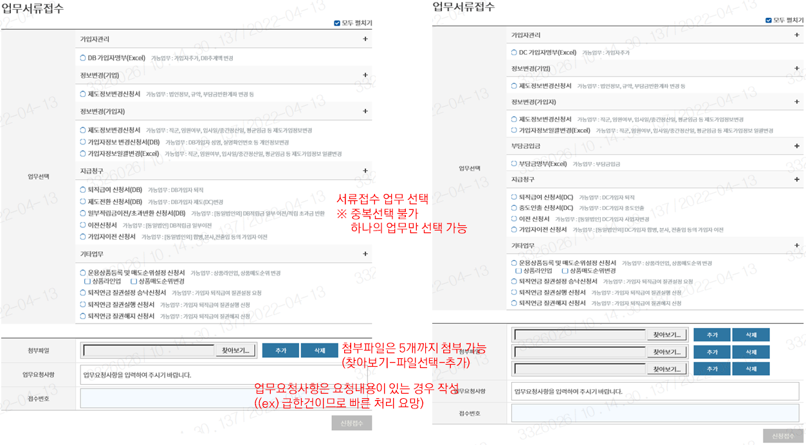

1\) 온라인 서비스 이용 가능 메뉴 중 하나이고, PC웹과 모바일웹 모두 사용이 가능한 『업무서류접수』 소개

\- 업무서류접수는, 업무간소화협약이 되어있는 경우 이용이 가능함. 스캔 서류를 이메일로 접수하는 것과

업무서류접수를 통해 접수하는 것이 똑같은 방법이라고 생각될 수도 있으나,

① 서류접수채널이 이메일 한정에서 온라인접수도 가능하도록 확대

② 이메일 서류접수 중 원본제출이 꼭 필요한 DC가입자명부의 경우, 업무서류접수를 통해 접수되는 서류는 전자문서로 인정되어 원본서류의 날인 대신 전자문서의 전자서명으로 그 효력이 인정됨에 따라 별도의 원본 서류 제출이 필요하지 않음

③ 또한, 이메일 접수의 경우 진행상황을 따로 문의하여 확인하지 않는 이상 메일 확인 여부등이 확인이 불가능한 반면에 온라인 서비스 업무서류접수시에는 접속한 사무담당자의 휴대전화로 단계별 카카오 알림톡이 발송되어 업무담당자가 해당 서류를 확인하고 접수처리한 경우 접수완료 알림, 보완이 필요하여 재접수 요청한 경우는 재접수 알림 등이 안내되어 접수 진행단계를 쉽게 확인할 수 있음

2\) 화면 안내 ※ 첨부 이미지 : 왼쪽이 DB제도/오른쪽이 DC제도의 서류접수 화면

(1단계) 요청하고자 하는 업무를 선택

\- 요청 업무는 복수선택이 불가능하므로 각 업무선택 건 별 진행.

(예) 1. 가입자 등록 신청 & 2.퇴직 신청

1\. 가입자명부 체크 – 첨부파일선택 - 신청접수 완료

2\. 퇴직급여신청서 체크 – 첨부파일선택 – 신청접수 완료

(2단계) 첨부파일 → 찾아보기로 PC에 저장되어 있는 파일 선택

\* 하나의 업무에 첨부파일은 최대 5개까지 첨부가 가능, 찾아보기 옆 추가 버튼 클릭 시 첨부파일 행이

하나씩 추가되어 복수의 파일 첨부가 가능함.

(3단계) 업무요청사항

\- 붉은색 글씨의 예와 같이, 전달하고자 하는 요청사항이 있는 경우 작성하면 업무담당자가 서류접수시

확인이 가능하니 함께 작성.

(4단계) 신청접수

\- 접수신청 완료 알림톡 발송, 당사 담당자가 접수 서류 검토 후 접수처리 시 접수완료 알림톡 발송

라. 업무서류접수(모바일 웹)

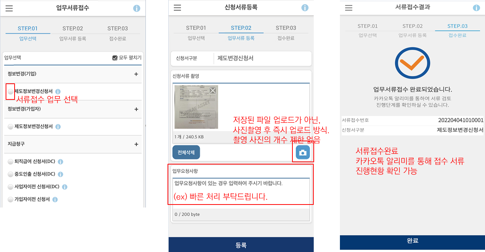

1\) 현재 모바일웹에서는 업무서류접수와 법인정보조회, 거래내역조회 서비스만 제공되고 있음

2\) 화면 안내

(1단계) 요청하고자 하는 업무를 선택

\- 요청 업무는 복수선택이 불가능하므로 각 업무선택 건 별 진행.

(2단계) 카메라 버튼 터치 → 사진 촬영 후 즉시 업로드

\* 모바일웹에서는 개인 휴대폰에 회사 또는 가입자 정보가 있는 파일의 저장을 방지하기 위하여 저장된 이미지 파일을 불러오는 형태가 아니라 촬영 후 파일 저장없이 즉시 업로드로 보안이 강화되어 있음 (사진촬영을 통한 서류접수 이므로 엑셀양식으로 접수되는 가입자명부, 부담금명부는 접수가 불가함)

파일첨부는 즉시 촬영 후 업로드이기 때문에 PC웹과는 다르게 개수 제한없이 여러 장 첨부가 가능함.

(3단계) 업무요청사항

\- 붉은색 글씨의 예와 같이, 전달하고자 하는 요청사항이 있는 경우 작성하면 업무담당자가 서류접수시

확인이 가능하니 함께 작성.

(4단계) 등록

\- 접수신청 완료 알림톡 발송, 당사 담당자가 접수 서류 검토 후 접수처리 시 접수완료 알림톡 발송
