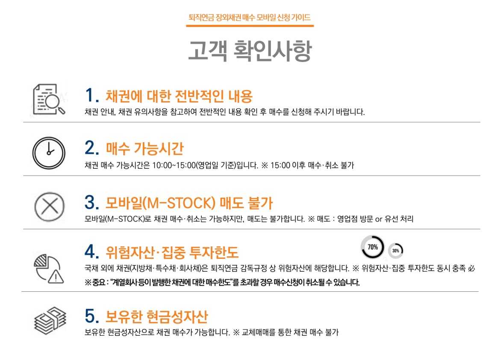

<!-- page: 1 -->
## PDF Page 1

# BAAS 장 외 채 권 매수 모바일신정 가이드 = 

자세히 보기 > 

MIRAE RESET”

<!-- page: 2 -->
## PDF Page 2

<!-- visual fallback: rendered directly from the source PDF page -->

### OCR 보조 텍스트

<!-- Automatic OCR may contain recognition errors; the rendered source page above is authoritative. -->
퇴직연금 장외채권매수 모바일신청 가이드
객 확인사항
고객 확인사항
Ee         1. 채권에 대한 전반적인 내용
200,      채권 안내, 채권 유의사항을 참고하여 전반적인 내용 확인 후 매수를 신청해 주시기 바랍니다.
       2. 매수 가능시간
채권 매수 가능시간은 10:00~15:00(영업일 기준)입니다. ※ 15:00 이후 매수-ㆍ취소 불가
(20     3. 모바일)/-510010 매도 불가
모바일/-5100{0로 채권 Ot FAS 가능하지만, 매도는 불가합니다. ※ 매도 : 영업점 방문 or 유선 처리
=                              =                                                 70%
gy 4. 위험자산-집중 투자한도          Oa
WN        국채 외에 MAAYA- SAH SAMS 퇴직연금 감독규정 상 위험자산에 해당합니다. ※ 위험자산-집중 투자한도 동시 충족 DM
A       ※중요: 계열회사등이발행한채권에대한매수한도"를 초과할경우 매수신청이취소될수 있습니다.
SB      5. 보유한 현금성자산
보유한 현금성자산으로 채권 매수가 가능합니다. ※ 교처매매를 통한 채권 매수 불가

<!-- page: 3 -->
## PDF Page 3

<!-- Start of picture text -->
퇴 직연금 장외채권매수 모바일 신청 가이드 IM) seriaseuan ‘ | M-STOCKS 설치해 주세요. @ kkk미래 에 셋증권 M-STOCK o =)= ON @ BAssesiRpP) 계좌 개설 | 퇴직연 금(개 인 형16[) 계좌가 없다면 M-STOCKOIA 개설해 주세요. → ※ DC-7IGSIRPE 가입 자명부 등록후 자동 계좌 개설 (연 금 관리 .ㅁ 계좌 온라인등록 메뉴에서 등록 후 가능) @ 22 Q x 계미리좌개챙설기에셨나요?필요한 준비 CREPcha Lea ous 5 주 식 ( 국 내화 외끼4 사줌개현 154. = 본인 명의 주민등록증, 운전면허증 S 주식 ( 국 내 /해 외)+04개인연 금(신규) = 서비 스 신청 타 금융기 관이체 가 능한 계좌 을 -주식 ( 국 내해외+044 8지/이벤트 AUPE CD ous 의 7 인 명 ae 지녀 SPs I/F eager acl 필요한 한 가지 계 죄 만 개설하기 saoifivn 671 ee8 69 aa awa | ca 발행어음 개인 연금; oma 이 용 / 계좌 유형 안내 신청 현황 조 회 /취소" 계좌개설 시작 선물옵션 케트 aay ND @ 희원기인 인증 등록 | 회원가입 후간편인증 등록 0 공동인증서를 발급해 주세요. <!-- End of picture text -->

<!-- page: 4 -->
## PDF Page 4

|• 〮〮〮〮〮〮〮〮〮〮〮〮〮〮〮〮〮〮〮〮〮〮〮〮〮〮〮〮〮〮〮〮〮〮〮〮〮〮〮〮〮〮〮〮〮〮〮〮〮〮〮〮〮〮〮〮〮〮〮〮〮〮〮〮〮〮〮〮〮〮〮〮〮〮〮〮〮〮〮〮〮〮〮〮〮〮〮〮〮〮〮〮〮〮〮〮〮〮〮〮〮〮〮〮〮〮〮〮〮〮〮〮〮〮〮〮〮〮〮〮〮〮〮〮〮〮〮〮〮〮〮〮〮〮〮〮〮〮〮〮〮〮〮〮〮〮〮〮〮〮〮〮〮〮〮〮〮〮〮〮〮〮〮〮〮〮〮〮〮〮〮〮〮〮〮〮〮〮〮〮 퇴직연금장외채권매수|
|---|
|• 〮〮〮〮〮〮〮〮〮〮〮〮〮〮〮〮〮〮〮〮〮〮〮〮〮〮〮〮〮〮〮〮〮〮〮〮〮〮〮〮〮〮〮〮〮〮〮〮〮〮〮〮〮〮〮〮〮〮〮〮〮〮〮〮〮〮〮〮〮〮〮〮〮〮〮〮〮〮〮〮〮〮〮〮〮〮〮〮〮〮〮〮〮〮〮〮〮〮〮〮〮〮〮〮〮〮〮〮〮〮〮〮〮〮〮〮〮〮〮〮〮〮〮〮〮〮〮〮〮〮〮〮〮〮〮〮〮〮〮〮〮〮〮〮〮〮〮〮〮〮〮〮〮〮〮〮〮〮〮〮〮〮〮〮〮〮〮〮〮〮〮〮〮〮〮〮〮〮〮〮 모의투자계산(만기상환)|
|• 〮〮〮〮〮〮〮〮〮〮〮〮〮〮〮〮〮〮〮〮〮〮〮〮〮〮〮〮〮〮〮〮〮〮〮〮〮〮〮〮〮〮〮〮〮〮〮〮〮〮〮〮〮〮〮〮〮〮〮〮〮〮〮〮〮〮〮〮〮〮〮〮〮〮〮〮〮〮〮〮〮〮〮〮〮〮〮〮〮〮〮〮〮〮〮〮〮〮〮〮〮〮〮〮〮〮〮〮〮〮〮〮〮〮〮〮〮〮〮〮〮〮〮〮〮〮〮〮〮〮〮〮〮〮〮〮〮〮〮〮〮〮〮〮〮〮〮〮〮〮〮〮〮〮〮〮〮〮〮〮〮〮〮〮〮〮〮〮〮〮〮〮〮〮〮〮〮〮〮〮 모의투자계산(중도매도)|
|• 〮〮〮〮〮〮〮〮〮〮〮〮〮〮〮〮〮〮〮〮〮〮〮〮〮〮〮〮〮〮〮〮〮〮〮〮〮〮〮〮〮〮〮〮〮〮〮〮〮〮〮〮〮〮〮〮〮〮〮〮〮〮〮〮〮〮〮〮〮〮〮〮〮〮〮〮〮〮〮〮〮〮〮〮〮〮〮〮〮〮〮〮〮〮〮〮〮〮〮〮〮〮〮〮〮〮〮〮〮〮〮〮〮〮〮〮〮〮〮〮〮〮〮〮〮〮〮〮〮〮〮〮〮〮〮〮〮〮〮〮〮〮〮〮〮〮〮〮〮〮〮〮〮〮〮〮〮〮〮〮〮〮〮〮〮〮〮〮〮〮〮〮〮〮〮〮〮〮〮〮〮〮〮〮〮〮〮〮〮〮〮〮〮〮〮〮〮〮〮〮〮〮〮〮〮〮〮〮〮〮〮〮〮〮〮〮〮〮〮〮〮〮〮〮〮〮〮 매수취소|

<!-- Start of picture text -->
4 <!-- End of picture text -->

<!-- Start of picture text -->
10 <!-- End of picture text -->

<!-- Start of picture text -->
13 <!-- End of picture text -->

<!-- Start of picture text -->
17 <!-- End of picture text -->

<!-- page: 5 -->
## PDF Page 5

## 퇴직연금장 외재권 매수 

<!-- Start of picture text -->
^ Ag es ^ 1 = | oa é-, Sera <!-- End of picture text -->

<!-- page: 6 -->
## PDF Page 6

퇴 직연금 장 외 채권 매수 모바일 신청 가이드 

퇴 직 연금 장 외 재 권 매수 신청 “IL-Ci © [aa 1 eo) 

<!-- Start of picture text -->
계 좌 선택 장외채권 탭 」 금 융 으 상품 사프 매매 메뉴 느 x K EH <!-- End of picture text -->

<!-- Start of picture text -->
C23) ‘wae > Qo x < 금융 상품매매 @ 준 미하시개 발메뉴 관 리 하기 824- [퇴직연 금 . 개 인 100) v ~ 루사하기 | | us ee 2 채 권 안내 연 금 포트폴리오 연 금계 좌 현황 x 연 금관리 미청 구 적립금 신청 wes선 수익를 wee ~ 니어 주간 핵 심 금융 상품 pone 가능수 량( 천 :500 연 금 저축계 좌 ( 신 ) 애매 = = 이버 3 ~ 4.86% i 금 융 상품 매매 연752-금 저 축 계 좌 ( 신 ) be잔 RGA) 존기간 : 347일 2 ABIES 70%- 투 자 한 도 30 ETF/21 매매 8 20 퇴 직연 금(26- 기업 형|0『"/ 개인형1") 계좌 선택 퇴직 연금 유 상청약 퇴 직연 금 . 개 인 mM ie) < 1 (a) < 11 O < <!-- End of picture text -->

5 

Mirae Asset Securities

<!-- page: 7 -->
## PDF Page 7

<!-- Start of picture text -->
퇴 직연금 장 <!-- End of picture text -->

<!-- Start of picture text -->
모바일 <!-- End of picture text -->

<!-- Start of picture text -->
가이드 <!-- End of picture text -->

<!-- Start of picture text -->
퇴 “LCi직연금 © <!-- End of picture text -->

<!-- Start of picture text -->
매수1 <!-- End of picture text -->

<!-- Start of picture text -->
ee <!-- End of picture text -->

<!-- Start of picture text -->
4 <!-- End of picture text -->

<!-- Start of picture text -->
매수할스 하구 <!-- End of picture text -->

<!-- Start of picture text -->
선택 <!-- End of picture text -->

<!-- Start of picture text -->
으유의의사항사한 판 <!-- End of picture text -->

<!-- Start of picture text -->
확인호 <!-- End of picture text -->

<!-- Start of picture text -->
< 금융상 품매매 @ 824- (Sets 7HQURP) ~ (e/2 -장외 채 권 안내 수 익를 높 은순~ 가능수량( 천):500 PE:— 4: | EN 컴 4.86% Pras 잔 존 기간 : 347일 위험 자산 한도 70%-투자 한도 30 11 ie) < <!-- End of picture text -->

<!-- Start of picture text -->
mn ° x 회사채 /특수채 투자 시 유의 사항 투자하신 채권들 중 서로 계열 관계인 채권들의 합계 금액이 고객님 적립금 의 40%H 넘을 수 없습니다. 시) a전지 + 4 회확 채 5 투투자자가능불가 ※ 체 권 매수 신청 마감(15시) 이후 위 사항에 HSE 경우, Ce eee ： 닫기 11 (a) < <!-- End of picture text -->

<!-- Start of picture text -->
6 <!-- End of picture text -->

<!-- Start of picture text -->
Hts발 행 <!-- End of picture text -->

<!-- Start of picture text -->
호 <!-- End of picture text -->

<!-- Start of picture text -->
6 <!-- End of picture text -->

<!-- Start of picture text -->
매수수 <!-- End of picture text -->

<!-- Start of picture text -->
클클릭 <!-- End of picture text -->

<!-- Start of picture text -->
aN! 상세 x 저 위 헐 40 회사채 컴 | 500 4.8340% . 9.773원 기 본 정보 투 자 등급 저위험(4등 급 ) uesa [coum M0 ~ cinta aes 표면 금리 2.2610% 발발 행행 일일 지 자 2021.07.27 00000 2 ~ 모의투자계산 매수 1 ㅣ ㅇㅁㅇ < <!-- End of picture text -->

<!-- Start of picture text -->
Mirae <!-- End of picture text -->

<!-- Start of picture text -->
Asset Securities <!-- End of picture text -->

➔

<!-- page: 8 -->
## PDF Page 8

퇴 직연금 장외채권 매수 모바일 신청 가이드 

~~SS~~ 

#### 7 매 스수수량스 래 이인력려 

<!-- Start of picture text -->
장외채 권 매수 x 824- [ 퇴직 연금 개 인100] AAS AO - 회사체 위험 자 산 한도 70%- 투자한도 30 <!-- End of picture text -->

<!-- Start of picture text -->
매수가능수량 계산기 장외채 권 매수 x 2 Wail 824- [ 퇴직연금 개 인100] 새권 최대 매수 가능금액 488.650원 저 위험 AO SAE 309 me Nose Para 타오 위 험자산한도 70%-투 자 한 도 <!-- End of picture text -->

<!-- Start of picture text -->
컴 컴 1 2 3 매수금리 4,8340% 매 수 금리 4.83409 매 수 단가 9.773 원 매 수 단가 9.773원 매수 가능수 량(천원) 500 4 5 6 매 수가능수 량(천원) 500 세전투자수익률( 연 ) 4.8600% 세전투자수익 율 ( 연 ) 4.8600% 세후투자수 익률 ( 연 ) 4.8600% 7 8 9 세후투자수 익 률 ( 연 ) 4.8600% 매 수수량수량 취소 30 @ 4매 수수량 채권매수 최대가능수량대가능수량가능수량수량 500천천 원 = = 채권매수 최대가능 수량 500 천 원 채권매수 최대가능대가능능 금액 488,650 1 수수량 입 1 폴 트돕 선증거금 해지 가능 채권 매수 최대가능 금 액< 488.650원 ill (a) < 1 fo) < <!-- End of picture text -->

1 매 수수량수량 채권매수 최대가능수량대가능수량가능수량수량 500천천 원 채권매수 최대가능대가능능 금액 488,650 ill (a) < 

7 

Mirae Asset Securities

<!-- page: 9 -->
## PDF Page 9

<!-- Start of picture text -->
퇴직연금 장 <!-- End of picture text -->

<!-- Start of picture text -->
모바일 <!-- End of picture text -->

<!-- Start of picture text -->
가이드 <!-- End of picture text -->

<!-- Start of picture text -->
퇴 “LCi직연금 © <!-- End of picture text -->

<!-- Start of picture text -->
매수1 <!-- End of picture text -->

<!-- Start of picture text -->
으 하 무 유의 사항 <!-- End of picture text -->

<!-- Start of picture text -->
* <!-- End of picture text -->

<!-- Start of picture text -->
E — <!-- End of picture text -->

<!-- Start of picture text -->
oa <!-- End of picture text -->

<!-- Start of picture text -->
장 외 채 권 매수 × 매 수수량 500 천 원 채권 매수 최대가능수량 500 천원 채권 매수 최대가 능 금액) 488.650원 매수 가능 금액 4,218, 3072! 디 폴트 옵션 증거금O OF “ 가용현금 = 매수가 능 금액 + 디 플트옵 션 증거금 디폴트옵션 증거금 해지 ※ 회ae사채 / 특수채 : 매수시 체크 : Ds 근무 하는 회사 또는 계열사 등이 발행한 채권이거나, 넘을동일계열관계채권경우 매수 취소 처합계리 될금+액 있습니다.이 적 립 금 의 40%가 2 다음 1 ㅁ < <!-- End of picture text -->

<!-- Start of picture text -->
장외채권매수 × 동 의해주세요. 님의 투자성향 고 객 님 의 투자성향은 권유 희망, 성장형 입니다 성장형 — 성장 형 은 시 장 평균 수 익률을 월씬 넘어서는 높은 수준 의 투 자 수 익을 추구 하며. 이를 위해 자 산 가 치의 변 동 에 따른 손실 위험 을 적극 수용. 투 자자금 대 부 분 을 주식 FARE 또는 파 생 상품 동의 위 험 자산에 투 자 하는 고객 입 ※ 두자성향, 투자권유여부에 따라 추가 서류확인 상품위험등급 > 투자성향 : 적합 (적정 )하지 않는 투 투자권유여부 -불원 : 투자권유 희망 및 투자자정보제 <!-- End of picture text -->

<!-- Start of picture text -->
8 <!-- End of picture text -->

<!-- Start of picture text -->
사 프이 히 드 그 ㅎ <!-- End of picture text -->

<!-- Start of picture text -->
장 외채 권 매수 × 상 품위험등급 컴 a 4 ———____— 12. 투 자 설명서 모두 보기 x : 이전 확인서 1 ㅁ < <!-- End of picture text -->

<!-- Start of picture text -->
Mirae <!-- End of picture text -->

<!-- Start of picture text -->
Asset Securities <!-- End of picture text -->

➔

<!-- page: 10 -->
## PDF Page 10

<!-- Start of picture text -->
퇴 직연금 장외 채권 매수 모바일 신청 가이드 SS 퇴 직연금 장 외 채 권 매수 신청 “IL-Ci © aa 1 eo) Ad설명서 미및유으 이의문구무구 확인호 매수스 정보 확인호 ➔ ➔ 11 디으음 버튼버트 클리클릭 12 마수AWE너든 크리클릭 66 3젤 매수신청A 시츠 왼료 1 외채권매수 x 장외채 권매수 x 장외채권 매수 × ae 아래 정보로 매수할까요? 운 용 지시 안내장 매수계좌 ㄷㄷ @ frase 제공 및설명 확인 [=】 기래 에 셋 증권 824: PMS 설 명서를 받음에 동의합니다. 1 매수신청 이 완료되었습니다. MMe 제공 받고 주요 내용에 대해 확 이 해 하였습니다. 인하고 컴 컴 pole실자를 가 하는투자권능 성 과것이며,유투를 자에받지귀사않고로부터본인투의자에판단따른에따라원금 매수금액 488, 6508 ※ 간편 인증 or  공동인증절차 진행 piacit하여 확 등인 하였습니다.Azle suisic따른 손 32익이 유 모두의 사황본 인에에게 매 수 수 량a(천원 so | 신청 내역조회 > 별도aie반기 상의ee imeol 품사표의 시만기처리가 없을He경우내용te 전까지을만기 상 환 되어sett 매MABRY수 단가 일반9.773회사채원 현 금 성 자산으로운 용 됩니다. 단 HESS 이 자 지 이 표채 확인 급 유형 매수!지정 하신 경우 디폴트옵션 절차에 따라 2 1 fe) < 1 fo) < 9 Mirae Asset Securities <!-- End of picture text -->

<!-- page: 11 -->
## PDF Page 11

<!-- visual fallback: rendered directly from the source PDF page -->

### OCR 보조 텍스트

<!-- Automatic OCR may contain recognition errors; the rendered source page above is authoritative. -->
모의투자계산(만기상환)

<!-- page: 12 -->
## PDF Page 12

<!-- Start of picture text -->
퇴 직연금 <!-- End of picture text -->

<!-- Start of picture text -->
모바일 <!-- End of picture text -->

<!-- Start of picture text -->
가이드 <!-- End of picture text -->

<!-- Start of picture text -->
모—의TT투자 계 KL산 (모 <!-- End of picture text -->

<!-- Start of picture text -->
바발히행 정보 <!-- End of picture text -->

<!-- Start of picture text -->
확인 호 <!-- End of picture text -->

<!-- Start of picture text -->
1 <!-- End of picture text -->

<!-- Start of picture text -->
| 20070 × 초 저위험 44 득 수체 한 41010% 10,3228 1,000 기‘ie본 정보 투 자 등급 초 저위험 (5 등급 ) 신 용 등급| 신용평가정보 AAA See aa 표 면 금리 4.7000% 25 — 1 (a) < <!-- End of picture text -->

<!-- Start of picture text -->
1 <!-- End of picture text -->

<!-- Start of picture text -->
매 스스수수랑 , <!-- End of picture text -->

<!-- Start of picture text -->
 매AO수일자 fe) <!-- End of picture text -->

<!-- Start of picture text -->
다음버튼으 <!-- End of picture text -->

<!-- Start of picture text -->
크클릭 <!-- End of picture text -->

<!-- Start of picture text -->
모의투자계산 x 한 1 수수 량(액면) 가능수량( 천 ) : 1,000 00 exer ※ 매수가능수량 계산기 2 3 lo 1 fe) < <!-- End of picture text -->

<!-- Start of picture text -->
매수가 능수량계산기 매 수희 망 금 액 (총액) +1만  +5만  +10만 . +1008) 전액 1 2 3 7 8 9 수량 입력 가능 0 @ <!-- End of picture text -->

<!-- Start of picture text -->
Mirae <!-- End of picture text -->

<!-- Start of picture text -->
Asset Securities <!-- End of picture text -->

> ➔ 모 의 투자계산 버튼트 크클릭 때 ➔

<!-- page: 13 -->
## PDF Page 13

<!-- Start of picture text -->
모 의투자계 산 ( 만 <!-- End of picture text -->

<!-- Start of picture text -->
CE <!-- End of picture text -->

<!-- Start of picture text -->
도의이 투트 자내역 <!-- End of picture text -->

<!-- Start of picture text -->
모의투자계산 × 한 모의투자내역 매 매 구분 매수 수 량 (천원) 968 PUA 2023.08.14 8 수 금리 4.1010% eri 16325 상환i 일자 2025.09.06 투 자 등급 초저 위험 (5등 급 ) 신 용 동급 AAA Pu 11 Le) < <!-- End of picture text -->

<!-- Start of picture text -->
12 <!-- End of picture text -->

<!-- Start of picture text -->
예AAO!상수익확인 <!-- End of picture text -->

<!-- Start of picture text -->
자세히ㅎ <!-- End of picture text -->

<!-- Start of picture text -->
클 리릭 <!-- End of picture text -->

<!-- Start of picture text -->
혀현 금근ㅎ흐 르름상세 <!-- End of picture text -->

<!-- Start of picture text -->
모의투자계산 × 1 예 상수익 발 행 이자율 4.7000% 이투자자기간지급 유형 개월2 년이표체24일 총투 자 수익율 8.26% 세 후투 자 수 익 률 (인 4.00% 예 금 환산수 익 률 ( 세전. 연) 400% 8 수 금액 (4 999,169 상 환 금액 990,748 실 수 령합 계 (8) 1,081,740 ane 93,836 원 천 징 수 금액 0 손익(8- 시 82571 현 금 흐 름(요약) 2 wea aa east 081,740 ° 1.081.740 mf oO < <!-- End of picture text -->

<!-- Start of picture text -->
현금 흐름 상세 × eat 4a 세후큼역| 1,081,740 ° 1,081,740 상세내여 nae 세전 금액 aa gas 20230906 22748 022748 20240305 (22,748 의 2274 20240906 22748 22004 20050306 22748 0 2274 20250906 990,748 0 99074 wt 1,081,740 © 1081.70 1 (a) < <!-- End of picture text -->

<!-- Start of picture text -->
Mirae <!-- End of picture text -->

<!-- Start of picture text -->
Asset Securities <!-- End of picture text -->

➔

<!-- page: 14 -->
## PDF Page 14

모 의 투 자계 산( 중 도 매 도)

<!-- page: 15 -->
## PDF Page 15

<!-- Start of picture text -->
퇴 직연금 <!-- End of picture text -->

<!-- Start of picture text -->
모바일 <!-- End of picture text -->

<!-- Start of picture text -->
가이드 <!-- End of picture text -->

<!-- Start of picture text -->
= NS 모 의 투 자 계 산 ( <!-- End of picture text -->

<!-- Start of picture text -->
HEE발 행정보상세 <!-- End of picture text -->

<!-- Start of picture text -->
확인= <!-- End of picture text -->

<!-- Start of picture text -->
1 <!-- End of picture text -->

<!-- Start of picture text -->
모 의 i=투자계산 <!-- End of picture text -->

<!-- Start of picture text -->
1 정보상세 x SHAY AAA BOS 한 niet dates Sy 기 본 정보 투 자 등급 초 저 위험 (5 등 급 ) 신 용 등급 | 신 용평 가정보 AAA 이 자 지 급 방법 이표채 표 면 금리 4,7000% | 발 행 일자 2022.09.06 11 10] < <!-- End of picture text -->

<!-- Start of picture text -->
14 <!-- End of picture text -->

<!-- Start of picture text -->
클릭 <!-- End of picture text -->

<!-- Start of picture text -->
Ye <!-- End of picture text -->

<!-- Start of picture text -->
매수스스수랑 , <!-- End of picture text -->

<!-- Start of picture text -->
 매수스이일자 fe) <!-- End of picture text -->

<!-- Start of picture text -->
모의투자 계산 x 한 [659 1 수 수 량(액면) 가 능 수 량 (천 ) : 1,000 awn ※ 매수 가 능수량 계산기 활 2 11 10] < <!-- End of picture text -->

<!-- Start of picture text -->
매수가 능수량계산기 매 수희 망금 액 (총액) +e  +5 만  +10만 . +100망ㅣ 전액 1 2 3 if 8 9 입력 가능 0 @ 0 입 력 완료 <!-- End of picture text -->

<!-- Start of picture text -->
Mirae <!-- End of picture text -->

<!-- Start of picture text -->
Asset Securities <!-- End of picture text -->

➔

<!-- page: 16 -->
## PDF Page 16

<!-- Start of picture text -->
퇴 직연금 <!-- End of picture text -->

<!-- Start of picture text -->
모바일 <!-- End of picture text -->

<!-- Start of picture text -->
가이드 <!-- End of picture text -->

<!-- Start of picture text -->
모=|의 ㅜ투 자 계 산(NS 중 <!-- End of picture text -->

<!-- Start of picture text -->
Re <!-- End of picture text -->

<!-- Start of picture text -->
매도일자, <!-- End of picture text -->

<!-- Start of picture text -->
매 도금리 <!-- End of picture text -->

<!-- Start of picture text -->
다음버튼 <!-- End of picture text -->

<!-- Start of picture text -->
클릭 <!-- End of picture text -->

<!-- Start of picture text -->
모 의 투자계산 × 물 가 상승률 soe wel 1 이 도금 리 | ~ < <!-- End of picture text -->

<!-- Start of picture text -->
15 <!-- End of picture text -->

<!-- Start of picture text -->
모 의 투 자내역 호 <!-- End of picture text -->

<!-- Start of picture text -->
× 모 의투자계산 한 모 의 투자내역 매수 수 량(천원) 968 배 수 일개 2023.08.14 wach 10,322 상 환일지 투 자 동급 초저 위 험 (5등 급 ) ‘esa AAA 11 Oo < <!-- End of picture text -->

<!-- Start of picture text -->
예사상스 수익 이 화 <!-- End of picture text -->

<!-- Start of picture text -->
ane i 예상수위 발이자지행이자율급 유형 4,7000% 6 개 월 이표채 투 자 기간 2 년 24일 총 투 자 수익률 8.03% 예 금환 산 수 익 률( 세 전.연 4.37% 매 수 금 액 (4) 999,169 실 수 령 합 계 (8) 1.079.483 충 과표 83,451 원 천징 수 금액 0 실손 익 (8- 시 80.314 11 ㅇㅁㅇ < <!-- End of picture text -->

<!-- Start of picture text -->
Mirae <!-- End of picture text -->

<!-- Start of picture text -->
Asset Securities <!-- End of picture text -->

➔

<!-- page: 17 -->
## PDF Page 17

<!-- Start of picture text -->
퇴 직연금 <!-- End of picture text -->

<!-- Start of picture text -->
모바일 <!-- End of picture text -->

<!-- Start of picture text -->
가이드 <!-- End of picture text -->

<!-- Start of picture text -->
모의 투 자 계산NS(중 <!-- End of picture text -->

<!-- Start of picture text -->
현 금 흐 름 (( <!-- End of picture text -->

<!-- Start of picture text -->
확 인? <!-- End of picture text -->

<!-- Start of picture text -->
자세히ㅎ <!-- End of picture text -->

<!-- Start of picture text -->
클리클릭 <!-- End of picture text -->

<!-- Start of picture text -->
모의투 자 계산 × 총 투 자 수익률 8.03% 세후 투 자 수 익 듈 ( 연) 437% 예 금 환산 수 익 롤 ( 세 전 . 연 43796 매 수 금 액 (4 999,169 상환 금액 Cy) 심수령합계 (8) 10098 총 과표 83.451 실손 익 (68-4) 80,314 eanm(ae 2ro! Sia tel ite sai i alien: 11 ㅇㅁㅇ < <!-- End of picture text -->

<!-- Start of picture text -->
16 <!-- End of picture text -->

<!-- Start of picture text -->
0@ <!-- End of picture text -->

<!-- Start of picture text -->
현 금 흐 름 상세상세 확 <!-- End of picture text -->

<!-- Start of picture text -->
현 금 흐 름 상세 × 세 전금역 세금 세 후금 액 1,079,483, 내 1,079,483 상세 내역 지급일 세전 금액 세금 neat 2024.03.06 22,748 ° 22,748 2025.06.14 988,491 ° 988,491 합계 1,079,483 0 1,079,483 11 (eo) < <!-- End of picture text -->

<!-- Start of picture text -->
Mirae <!-- End of picture text -->

<!-- Start of picture text -->
Asset Securities <!-- End of picture text -->

➔

<!-- page: 18 -->
## PDF Page 18

### 매수 취소 

<!-- Start of picture text -->
— ANS > <!-- End of picture text -->

<!-- page: 19 -->
## PDF Page 19

<!-- Start of picture text -->
퇴 직연금장 <!-- End of picture text -->

<!-- Start of picture text -->
모바일 <!-- End of picture text -->

<!-- Start of picture text -->
가이드 <!-- End of picture text -->

<!-- Start of picture text -->
매수 취 <!-- End of picture text -->

<!-- Start of picture text -->
연그금 계 좌혀현황호 <!-- End of picture text -->

<!-- Start of picture text -->
C23) 님정보 > Qo x 준미하시 ~ 두 사하기 관리 하기 1 wa Myo 3 연 금 관리 미청= 구적립금 신청J eae 주주간핵 심심금금 융융 상품 상품 Ly 금 융 상품 매매 61/ 리 츠 매매 퇴 직 연금 유 상 청약 1 (a) < <!-- End of picture text -->

<!-- Start of picture text -->
18 <!-- End of picture text -->

<!-- Start of picture text -->
2 <!-- End of picture text -->

<!-- Start of picture text -->
계지 <!-- End of picture text -->

<!-- Start of picture text -->
x 계좌 선택 628- 연 금저축 계 좌 ( 신 ) biped 연 금저축 계좌 ( 신 ) 퇴 직 연 금 (0(- 기 업 형 0『/ 개 인형!) 계좌 선택 024"퇴직 연 금. 개 인 15 11 (a) < <!-- End of picture text -->

<!-- Start of picture text -->
3 <!-- End of picture text -->

<!-- Start of picture text -->
/[|포 드 운 셔 <!-- End of picture text -->

<!-- Start of picture text -->
매매 내역fe; <!-- End of picture text -->

<!-- Start of picture text -->
< 연금계좌 현 횡 1 HENS SSHer eee ㅋ Pus Does 2023.08.14 A184 한id 93062) 매 수 취소 i Oo < <!-- End of picture text -->

<!-- Start of picture text -->
Mirae <!-- End of picture text -->

<!-- Start of picture text -->
Asset Securities <!-- End of picture text -->

➔

<!-- page: 20 -->
## PDF Page 20

퇴 직연금 장 외채권매수 모바일 신청 가이드 

<!-- Start of picture text -->
매수A 취 소ㅅ <!-- End of picture text -->

<!-- Start of picture text -->
AX 튼 크 A K4x 튼 크 < 연금계좌현황 신청 내역 상세 x ~ 금융상품/디폴트옵션 Serene To 매수정보 신 청 중 : 한 금액/비율 3, 306 원 원 전체 ~ 주문일 2023.08.14 | ~ r+ 2023.08.14 신청 결제일 2023.08.14 한 9.306원 ee Aaa <!-- End of picture text -->

<!-- Start of picture text -->
K4x 튼 크 x Ss x ㄷ3 매수 취소 신청 이 완료되었습니다. 3, 306 원 원 2023.08.14 2023.08.14 bd ee x 간편인증or공동 인증 절차진행 신 ES ㅣ 10) < <!-- End of picture text -->

19 

Mirae Asset Securities

<!-- page: 21 -->
## PDF Page 21

감 사 합니다 

MIRAE미 래ASSET에 셋증권 J
